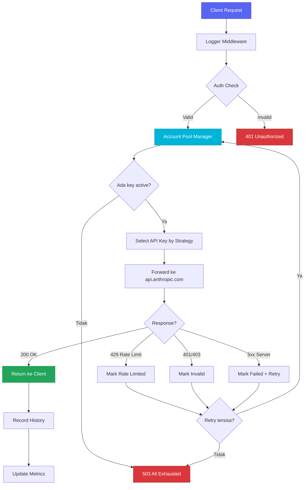
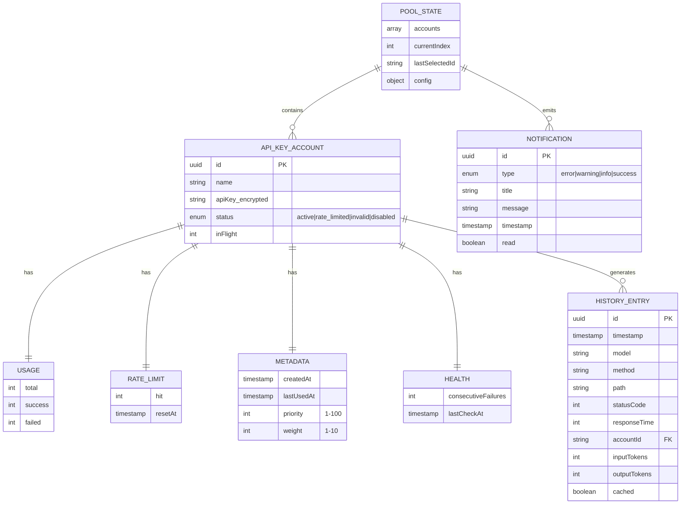

# claude-api

<div align="center">


<br><br>

**proxy server buat nge-pool multiple Anthropic API key dengan auto rotation, smart retry, dan monitoring dashboard real-time. satu command docker, langsung jalan.**

<br>

[Quick Start](#quick-start-docker) · [Dashboard](#dashboard) · [API Reference](#api-reference) · [Strategies](#pool-strategies) · [Docker](#docker)

</div>

---

## deskripsi

claude-api adalah proxy server yang duduk di antara Claude Code (atau Anthropic SDK manapun) dan Anthropic API. fungsinya simpel tapi powerful: kamu masukin beberapa API key, dia yang urus rotasi, retry, dan monitoring.

kenapa butuh ini? karena Anthropic punya rate limit per API key. kalo kamu cuma punya 1 key dan kena rate limit, ya stuck. tapi kalo punya 3-5 key dan di-pool, request otomatis pindah ke key lain yang masih available. zero downtime, zero manual intervention.

ini terinspirasi dari arsitektur [copilot-api](https://github.com/el-pablos/copilot-api) yang udah proven di production buat GitHub Copilot token pooling. konsepnya sama, tapi di-rebuild dari nol buat Anthropic Claude ecosystem.

### fitur utama

- **multi API key pooling** — tambahin berapa aja key, semuanya di-manage otomatis
- **5 rotation strategies** — round-robin, weighted, least-used, priority, random
- **auto failover** — key kena 429? langsung rotate ke key lain tanpa client tau
- **smart retry** — exponential backoff dengan jitter, configurable max attempts
- **rate limit detection** — deteksi 429 dari response, mark key, auto-recover setelah cooldown
- **auth error handling** — key invalid (401/403)? langsung di-mark, ga dipake lagi sampe di-fix
- **encrypted storage** — API key di-encrypt AES-256-GCM sebelum disimpan ke disk
- **monitoring dashboard** — real-time stats, account management, log streaming, notifications
- **SSE log streaming** — live server logs langsung di browser, filter by level
- **request history** — track semua request dengan pagination dan filtering
- **notification center** — alert otomatis kalo ada key yang kena rate limit atau invalid
- **docker ready** — 1 command, langsung jalan. cleanup juga bersih
- **drop-in replacement** — cukup ganti `ANTHROPIC_BASE_URL`, Claude Code langsung lewat proxy
- **mobile-first dashboard** — responsive, sidebar desktop, bottom nav mobile, touch-friendly

---

## arsitektur

### overview sistem

```
┌──────────────────────────────────────────────────────┐
│                      Client                           │
│           (Claude Code / Anthropic SDK)               │
│                                                       │
│   ANTHROPIC_BASE_URL=http://localhost:4143            │
└──────────────────────┬───────────────────────────────┘
                       │
                       ▼
┌──────────────────────────────────────────────────────┐
│                claude-api proxy                       │
│                                                       │
│  ┌─────────┐  ┌─────────┐  ┌─────────┐  ┌────────┐ │
│  │ Logger  │→ │  Auth   │→ │ Account │→ │  Error │ │
│  │Middleware│  │Middleware│  │Selector │  │Handler │ │
│  └─────────┘  └─────────┘  └────┬────┘  └────────┘ │
│                                  │                    │
│                    ┌─────────────▼──────────────┐    │
│                    │    Account Pool Manager     │    │
│                    │                             │    │
│                    │  ┌────┐ ┌────┐ ┌────┐      │    │
│                    │  │Key1│ │Key2│ │Key3│ ...   │    │
│                    │  └────┘ └────┘ └────┘      │    │
│                    │                             │    │
│                    │  Strategies:                │    │
│                    │  ○ round-robin   ○ weighted │    │
│                    │  ○ least-used    ○ priority │    │
│                    │  ○ random                   │    │
│                    └─────────────┬──────────────┘    │
│                                  │                    │
│                    ┌─────────────▼──────────────┐    │
│                    │      Proxy Handler          │    │
│                    │   + Retry Logic (backoff)   │    │
│                    │   + Rate Limit Detection    │    │
│                    │   + SSE Pass-through        │    │
│                    └─────────────┬──────────────┘    │
│                                  │                    │
│  ┌─────────────┐  ┌─────────────┐  ┌─────────────┐  │
│  │  Dashboard  │  │  History    │  │Notification │  │
│  │   WebUI     │  │  Tracker   │  │   Center    │  │
│  └─────────────┘  └─────────────┘  └─────────────┘  │
└──────────────────────┼───────────────────────────────┘
                       │
                       ▼
              ┌─────────────────┐
              │api.anthropic.com│
              └─────────────────┘
```

### stack teknologi

| komponen    | teknologi                           |
| ----------- | ----------------------------------- |
| runtime     | Node.js 22+                         |
| language    | TypeScript (strict mode)            |
| framework   | Hono                                |
| http server | @hono/node-server                   |
| validation  | Zod                                 |
| testing     | Vitest (126 tests)                  |
| dashboard   | Alpine.js + Tailwind CSS + Chart.js |
| container   | Docker (Alpine-based, multi-stage)  |
| ci/cd       | GitHub Actions                      |

### struktur file

```
claude-api/
├── src/
│   ├── index.ts                    # entry point, server setup, graceful shutdown
│   ├── lib/
│   │   ├── types.ts                # semua TypeScript types & interfaces
│   │   ├── config.ts               # config loader dari environment variables
│   │   ├── account-manager.ts      # core pool manager (add/remove/select/rotate)
│   │   ├── pool-strategy.ts        # 5 selection strategies
│   │   ├── proxy.ts                # proxy handler + retry + rate limit detection
│   │   ├── retry.ts                # exponential backoff dengan jitter
│   │   ├── crypto.ts               # AES-256-GCM encrypt/decrypt
│   │   ├── logger.ts               # structured JSON logger + event emitter
│   │   ├── metrics.ts              # request metrics (RPM, avg response time)
│   │   ├── storage.ts              # file-based JSON persistence (debounced)
│   │   ├── request-history.ts      # request history tracker + SSE events
│   │   └── notification-center.ts  # notification CRUD + events
│   ├── middleware/
│   │   ├── auth.ts                 # bearer token + basic auth
│   │   ├── logger.ts               # request logging middleware
│   │   └── error-handler.ts        # global error handler
│   ├── routes/
│   │   ├── api.ts                  # proxy routes (POST /v1/messages, GET /v1/models)
│   │   ├── health.ts               # health check endpoints (k8s compatible)
│   │   ├── dashboard.ts            # serve dashboard HTML
│   │   ├── dashboard-api.ts        # dashboard REST API (14 endpoints)
│   │   ├── log-stream.ts           # SSE log streaming
│   │   ├── history-api.ts          # request history API + SSE
│   │   └── notifications-api.ts    # notification CRUD API
│   └── dashboard/
│       └── index.html              # single-file SPA (Alpine.js + Tailwind)
├── tests/
│   ├── setup.ts
│   └── unit/lib/
│       ├── account-manager.test.ts  # 44 tests
│       ├── pool-strategy.test.ts    # 23 tests
│       ├── retry.test.ts            # 22 tests
│       ├── crypto.test.ts           # 11 tests
│       ├── metrics.test.ts          # 11 tests
│       ├── config.test.ts           # 7 tests
│       └── storage.test.ts          # 8 tests
├── Dockerfile                       # multi-stage build (deps → test → production)
├── docker-compose.yml               # 1-command setup
├── .dockerignore
├── .github/workflows/ci.yml         # test + docker build + auto release
├── package.json
├── tsconfig.json
├── vitest.config.ts
└── env.example
```

---

## flowchart request



---

## data model (ERD)



---

## quick start (docker)

cara paling gampang — 1 command, semuanya jalan:

```bash
# clone
git clone https://github.com/el-pablos/claude-api.git
cd claude-api

# buat .env (minimal ENCRYPTION_KEY)
echo "ENCRYPTION_KEY=$(openssl rand -hex 16)" > .env

# build & run
docker compose up -d

# cek status
docker compose ps
docker compose logs -f claude-api
```

dashboard langsung bisa diakses di **http://localhost:4143/dashboard**

### cleanup bersih

```bash
# stop container
docker compose down

# stop + hapus volumes (data pool & logs)
docker compose down -v

# hapus image juga
docker compose down -v --rmi all
```

bersih. ga ada sisa.

---

## quick start (tanpa docker)

```bash
git clone https://github.com/el-pablos/claude-api.git
cd claude-api

npm install

# buat .env
cp env.example .env
# edit ENCRYPTION_KEY (min 32 chars)

# development (auto-reload)
npm run dev

# production
npm start
```

---

## docker

### build manual

```bash
# build image
docker build -t claude-api .

# run container
docker run -d \
  --name claude-api \
  -p 4143:4143 \
  -e ENCRYPTION_KEY="your-32-char-key-here-minimum!!" \
  -e API_SECRET_KEY="your-dashboard-secret" \
  -v claude-data:/app/data \
  -v claude-logs:/app/logs \
  claude-api
```

### docker compose (recommended)

```bash
# buat .env dulu
cat > .env << 'EOF'
ENCRYPTION_KEY=your-32-char-encryption-key-here
API_SECRET_KEY=your-dashboard-secret
POOL_STRATEGY=round-robin
DASHBOARD_PASSWORD=your-password
EOF

# run
docker compose up -d

# logs
docker compose logs -f

# stop
docker compose down
```

### compatibility

| platform                    | status |
| --------------------------- | ------ |
| Linux (Ubuntu/Debian)       | tested |
| Linux (Alpine/CentOS)       | tested |
| macOS (Intel/Apple Silicon) | tested |
| Windows (Docker Desktop)    | tested |
| VPS (any provider)          | tested |

image-nya based on `node:22-alpine` — lightweight (~180MB), security-hardened (non-root user), proper signal handling (tini).

---

## dashboard

dashboard web-based yang bisa diakses di `http://localhost:4143/dashboard`. dibangun pake Alpine.js + Tailwind CSS dengan Discord-style dark theme.

### tabs yang tersedia

| tab               | fungsi                                                                                                                             |
| ----------------- | ---------------------------------------------------------------------------------------------------------------------------------- |
| **Dashboard**     | overview stats — total keys, active, rate limited, invalid, disabled, req/min, success rate, avg response time, distribution chart |
| **Accounts**      | manage API keys — tambah, hapus, disable/enable, reset rate limit. tabel dengan status badge, request count, success rate          |
| **Logs**          | real-time server log streaming via SSE. filter by level (info/warn/error/debug), pause/resume, clear                               |
| **History**       | request history — semua request yang pernah diproses. filter by status, stats aggregated                                           |
| **Settings**      | config — pool strategy, max retries, rate limit cooldown, log level. server info panel                                             |
| **Notifications** | alert center — notifikasi otomatis saat key rate limited, invalid, atau recovered                                                  |

### responsive design

- **desktop**: fixed sidebar 240px, spacious cards, data tables
- **mobile**: sticky header, bottom navigation (4 items), touch-friendly, compact tables

---

## cara pakai

### 1. tambah API key

**via dashboard:**
buka `http://localhost:4143/dashboard` → tab Accounts → klik "+ Add Key"

**via API:**

```bash
curl -X POST http://localhost:4143/api/dashboard/accounts \
  -H "Content-Type: application/json" \
  -d '{"name":"key-1","apiKey":"sk-ant-api03-xxx","priority":50,"weight":1}'
```

### 2. arahkan Claude Code

```bash
export ANTHROPIC_BASE_URL=http://localhost:4143
claude
```

selesai. semua request Claude Code otomatis lewat proxy, key dirotasi otomatis.

### 3. monitor

buka dashboard, pantau real-time:

- key mana yang aktif
- berapa req/min
- ada yang kena rate limit ga
- log server live

---

## konfigurasi

semua via environment variables:

| variable                     | default                     | deskripsi                                       |
| ---------------------------- | --------------------------- | ----------------------------------------------- |
| `PORT`                       | `4143`                      | port server                                     |
| `HOST`                       | `0.0.0.0`                   | host binding                                    |
| `API_SECRET_KEY`             | -                           | secret key buat dashboard API auth              |
| `ENCRYPTION_KEY`             | -                           | key enkripsi credential (min 32 chars)          |
| `POOL_STRATEGY`              | `round-robin`               | strategi rotasi (lihat section pool strategies) |
| `MAX_RETRIES`                | `3`                         | max retry per request                           |
| `RATE_LIMIT_COOLDOWN`        | `60000`                     | cooldown setelah rate limit (ms)                |
| `RATE_LIMIT_MAX_CONSECUTIVE` | `5`                         | max gagal berturut-turut sebelum mark invalid   |
| `CLAUDE_BASE_URL`            | `https://api.anthropic.com` | target API                                      |
| `CLAUDE_API_TIMEOUT`         | `300000`                    | timeout per request (ms)                        |
| `LOG_LEVEL`                  | `info`                      | level logging (debug/info/warn/error)           |
| `DASHBOARD_ENABLED`          | `true`                      | enable/disable dashboard                        |
| `DASHBOARD_USERNAME`         | `admin`                     | username basic auth dashboard                   |
| `DASHBOARD_PASSWORD`         | -                           | password dashboard (kosong = no auth)           |

---

## pool strategies

### round-robin (default)

request didistribusi merata ke semua key secara berurutan. key pertama, kedua, ketiga, balik lagi ke pertama. key yang rate limited otomatis di-skip.

**cocok buat**: distribusi merata, general purpose

### weighted

mirip round-robin tapi key dengan weight lebih tinggi dapat lebih banyak request. key weight 3 dapat 3x lebih banyak dari weight 1.

**cocok buat**: key dengan tier/limit berbeda

### least-used

selalu pilih key yang paling sedikit sedang memproses request (in-flight). kalau ada tie, pilih yang total request-nya paling rendah.

**cocok buat**: request yang response time-nya bervariasi

### priority

selalu coba key priority tertinggi dulu. turun ke priority lebih rendah kalau yang tinggi lagi ga available.

**cocok buat**: key premium sebagai primary, key murah sebagai fallback

### random

pilih key secara acak dari yang available. unpredictable tapi simple.

**cocok buat**: distribusi tanpa pattern, anti-detection

---

## API reference

### proxy endpoints

endpoint ini yang dipakai client (Claude Code):

| method | path           | deskripsi                                             |
| ------ | -------------- | ----------------------------------------------------- |
| `POST` | `/v1/messages` | proxy ke Anthropic Messages API (streaming supported) |
| `GET`  | `/v1/models`   | list available models                                 |

### health endpoints

| method | path               | deskripsi                  |
| ------ | ------------------ | -------------------------- |
| `GET`  | `/health`          | simple health check        |
| `GET`  | `/health/detailed` | pool status + metrics      |
| `GET`  | `/health/live`     | kubernetes liveness probe  |
| `GET`  | `/health/ready`    | kubernetes readiness probe |

### dashboard API

| method   | path                                           | deskripsi                   |
| -------- | ---------------------------------------------- | --------------------------- |
| `GET`    | `/api/dashboard/stats`                         | pool statistics             |
| `GET`    | `/api/dashboard/status`                        | server version, uptime      |
| `GET`    | `/api/dashboard/accounts`                      | list semua account          |
| `GET`    | `/api/dashboard/accounts/:id`                  | detail satu account         |
| `POST`   | `/api/dashboard/accounts`                      | tambah account              |
| `PUT`    | `/api/dashboard/accounts/:id`                  | update account              |
| `DELETE` | `/api/dashboard/accounts/:id`                  | hapus account               |
| `POST`   | `/api/dashboard/accounts/:id/disable`          | disable account             |
| `POST`   | `/api/dashboard/accounts/:id/enable`           | enable account              |
| `POST`   | `/api/dashboard/accounts/:id/reset-rate-limit` | reset rate limit            |
| `GET`    | `/api/dashboard/metrics`                       | real-time metrics           |
| `GET`    | `/api/dashboard/logs`                          | recent request logs         |
| `GET`    | `/api/dashboard/logs/stream`                   | SSE log streaming           |
| `GET`    | `/api/dashboard/config`                        | read config                 |
| `PUT`    | `/api/dashboard/config`                        | update config               |
| `GET`    | `/api/dashboard/history`                       | request history (paginated) |
| `GET`    | `/api/dashboard/history/stats`                 | history statistics          |
| `DELETE` | `/api/dashboard/history`                       | clear history               |
| `GET`    | `/api/dashboard/notifications`                 | list notifications          |
| `POST`   | `/api/dashboard/notifications/:id/read`        | mark read                   |
| `POST`   | `/api/dashboard/notifications/read-all`        | mark all read               |
| `DELETE` | `/api/dashboard/notifications/:id`             | delete notification         |
| `DELETE` | `/api/dashboard/notifications`                 | clear all                   |

---

## state machine account

```
                 ┌──────────┐
                 │  ACTIVE   │◄──────────────────────────┐
                 └─────┬─────┘                           │
                       │                                  │
          ┌────────────┼────────────────┐                │
          │            │                │                │
          ▼            ▼                ▼                │
   ┌────────────┐ ┌──────────┐  ┌───────────┐          │
   │RATE_LIMITED│ │ INVALID  │  │ DISABLED  │          │
   │  (auto)    │ │ (manual) │  │  (manual) │          │
   └─────┬──────┘ └────┬─────┘  └─────┬─────┘          │
         │              │               │                │
         │ cooldown     │ enable        │ enable         │
         │ expires      │ via API       │ via API        │
         │              │               │                │
         └──────────────┴───────────────┘────────────────┘
```

- **ACTIVE → RATE_LIMITED**: response 429 dari Anthropic
- **ACTIVE → INVALID**: response 401/403, atau 5+ consecutive failures
- **ACTIVE → DISABLED**: admin disable manual via dashboard
- **RATE_LIMITED → ACTIVE**: otomatis setelah cooldown period
- **INVALID → ACTIVE**: admin enable manual via dashboard
- **DISABLED → ACTIVE**: admin enable manual via dashboard

---

## security

- **API key encryption**: semua key di-encrypt AES-256-GCM sebelum disimpan ke disk
- **key masking**: API key ga pernah di-log atau di-return full — selalu masked (`sk-ant-...xxxx`)
- **dashboard auth**: basic auth + bearer token authentication
- **non-root docker**: container jalan sebagai non-root user
- **proper signal handling**: tini sebagai PID 1, graceful shutdown

---

## testing

```bash
# semua test
npm test

# unit tests aja
npm run test:unit

# dengan coverage
npm run test:coverage

# watch mode (development)
npm run test:watch
```

test stats saat ini:

```
Test Suites:  7 passed (7)
Tests:        126 passed (126)
Duration:     ~7s
```

test coverage meliputi:

- account-manager: add, remove, update, rotation, state changes, events (44 tests)
- pool-strategy: round-robin, weighted, least-used, priority, random (23 tests)
- retry: exponential backoff, retryable status detection, context passing (22 tests)
- crypto: encrypt/decrypt, key masking, edge cases (11 tests)
- metrics: recording, RPM calculation, percentiles (11 tests)
- storage: load, save, corrupt handling, directory creation (8 tests)
- config: env parsing, validation, defaults (7 tests)

---

## troubleshooting

**semua key kena rate limit**
→ proxy return 503. tunggu cooldown atau tambah key baru di dashboard.

**key di-mark invalid**
→ cek key di Anthropic Console. enable kembali via dashboard setelah fix.

**streaming ga jalan**
→ pastikan client support SSE. proxy forward streaming as-is.

**dashboard ga bisa diakses**
→ cek `DASHBOARD_ENABLED=true`. kalo pake password, set `DASHBOARD_PASSWORD`.

**docker container ga start**
→ cek logs: `docker compose logs claude-api`. biasanya masalah ENCRYPTION_KEY belum di-set.

---

## development

```bash
# clone
git clone https://github.com/el-pablos/claude-api.git
cd claude-api

# install
npm install

# dev mode (auto-reload)
npm run dev

# typecheck
npm run typecheck

# test
npm test
```

---

## kontributor

<table>
  <tr>
    <td align="center">
      <a href="https://github.com/el-pablos">
        <br>
        <sub><b>el-pablos</b></sub>
      </a><br>
      <sub>creator & maintainer</sub>
    </td>
  </tr>
</table>

---

## statistik

| metrik          | value            |
| --------------- | ---------------- |
| total files     | 27+ source files |
| total tests     | 126              |
| test pass rate  | 100%             |
| docker image    | ~180MB (alpine)  |
| startup time    | < 1s             |
| dependencies    | 4 runtime, 5 dev |
| API endpoints   | 24               |
| pool strategies | 5                |
| dashboard tabs  | 6                |

---

## license

MIT License — bebas dipakai, dimodifikasi, dan didistribusikan.

---

<div align="center">
  <sub>built with obsession by <a href="https://github.com/el-pablos">el-pablos</a></sub>
</div>
