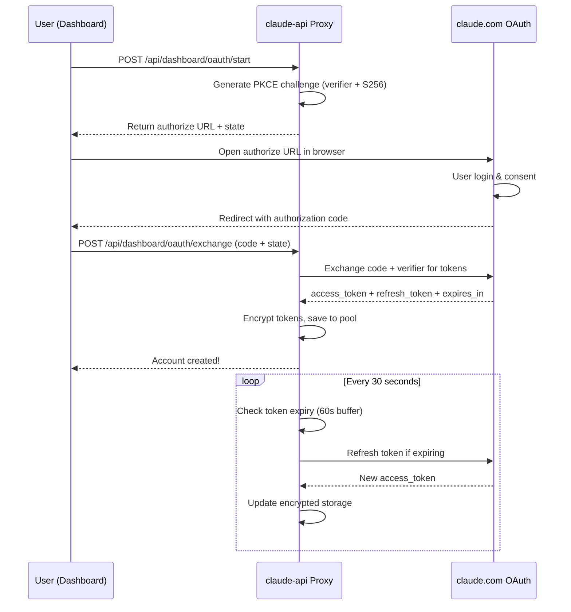
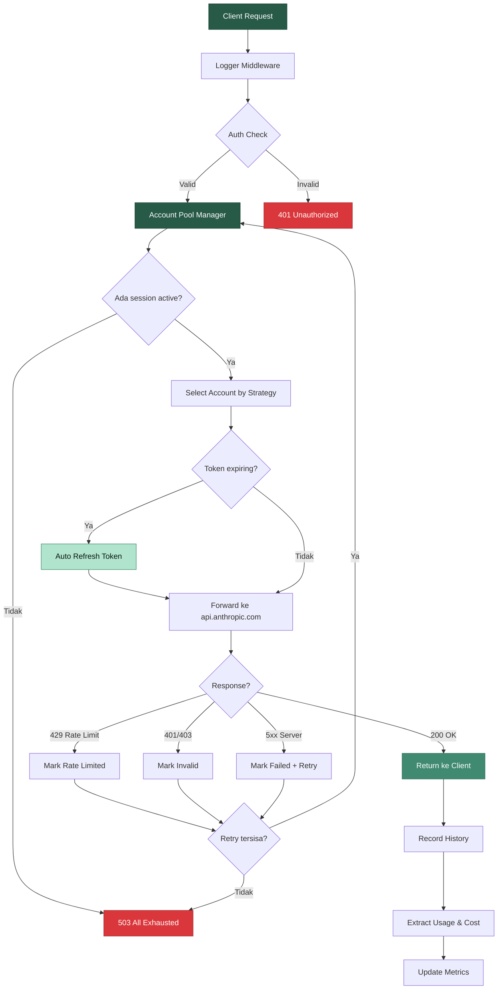
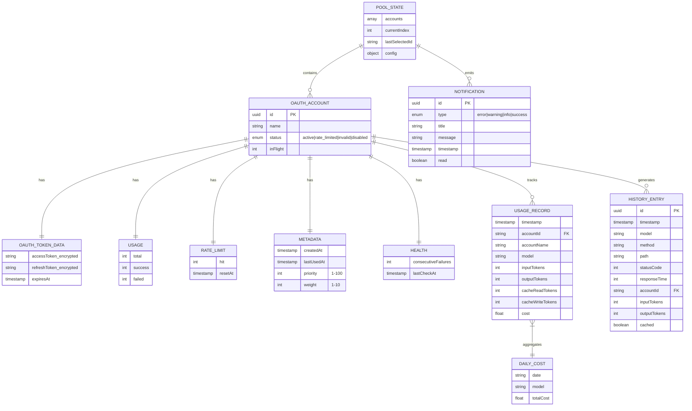

# claude-api

<div align="center">


<br><br>

**proxy server buat nge-pool multiple Claude OAuth session dengan auto rotation, smart retry, token auto-refresh, usage tracking, cost calculator, dan monitoring dashboard real-time.**

<br>

[Quick Start](#quick-start-docker) · [OAuth Login](#oauth-login-flow) · [Dashboard](#dashboard) · [API Reference](#api-reference) · [Strategies](#pool-strategies) · [Docker](#docker) · [Windows & VPS Guide](#cara-jalanin-di-windows-native) · [Usage & Cost](#usage--cost-tracking)

</div>

---

## deskripsi

claude-api adalah proxy server yang duduk di antara Claude Code (atau Anthropic SDK manapun) dan Anthropic API. fungsinya simpel tapi powerful: kamu login pake akun Claude, dia yang urus rotasi session, retry, token refresh, dan monitoring.

kenapa butuh ini? karena Anthropic punya rate limit per session. kalo kamu cuma punya 1 akun dan kena rate limit, ya stuck. tapi kalo punya 2-5 akun Claude dan di-pool, request otomatis pindah ke session lain yang masih available. zero downtime, zero manual intervention.

bedanya sama versi sebelumnya: **ga pake API key lagi**. sekarang pake **OAuth 2.0 PKCE flow** langsung dari akun Claude kamu. lebih aman, token auto-refresh, dan ga perlu generate API key manual di console.

ini terinspirasi dari arsitektur [copilot-api](https://github.com/el-pablos/copilot-api) yang udah proven di production buat GitHub Copilot token pooling. konsepnya sama, tapi di-rebuild dari nol buat Anthropic Claude ecosystem dengan OAuth session-based auth.

### fitur utama

- **OAuth 2.0 PKCE login** — login langsung pake akun Claude, ga perlu API key
- **auto token refresh** — background job refresh token setiap 30 detik, 60 detik buffer sebelum expired
- **multi session pooling** — tambahin berapa aja akun Claude, semuanya di-manage otomatis
- **5 rotation strategies** — round-robin, weighted, least-used, priority, random
- **auto failover** — session kena 429? langsung rotate ke session lain tanpa client tau
- **smart retry** — exponential backoff dengan jitter, configurable max attempts
- **rate limit detection** — deteksi 429 dari response, mark session, auto-recover setelah cooldown
- **auth error handling** — token invalid (401/403)? langsung di-mark, ga dipake lagi sampe di-refresh
- **encrypted storage** — OAuth tokens di-encrypt AES-256-GCM sebelum disimpan ke disk
- **usage tracking** — track token usage per request: input tokens, output tokens, cache hits, per model & per account
- **cost calculator** — hitung estimasi cost berdasarkan Anthropic pricing terbaru, daily cost history, cost by model
- **monitoring dashboard** — real-time stats, account management, log streaming, usage charts, cost breakdown
- **SSE log streaming** — live server logs langsung di browser, filter by level
- **request history** — track semua request dengan pagination dan filtering
- **notification center** — alert otomatis kalo ada session yang kena rate limit atau invalid
- **docker ready** — 1 command, langsung jalan. cleanup juga bersih
- **drop-in replacement** — cukup ganti `ANTHROPIC_BASE_URL`, Claude Code langsung lewat proxy
- **forest green theme** — dashboard dengan warna hijau forest yang clean dan professional

---

## arsitektur

### overview sistem

```
┌──────────────────────────────────────────────────────┐
│                      Client                           │
│           (Claude Code / Anthropic SDK)               │
│                                                       │
│   ANTHROPIC_BASE_URL=http://localhost:4143            │
└──────────────────────┬───────────────────────────────┘
                       │
                       ▼
┌──────────────────────────────────────────────────────┐
│                claude-api proxy                       │
│                                                       │
│  ┌─────────┐  ┌─────────┐  ┌─────────┐  ┌────────┐ │
│  │ Logger  │→ │  Auth   │→ │ Account │→ │  Error │ │
│  │Middleware│  │Middleware│  │Selector │  │Handler │ │
│  └─────────┘  └─────────┘  └────┬────┘  └────────┘ │
│                                  │                    │
│                    ┌─────────────▼──────────────┐    │
│                    │    Account Pool Manager     │    │
│                    │    (OAuth Session Pool)     │    │
│                    │                             │    │
│                    │  ┌────┐ ┌────┐ ┌────┐      │    │
│                    │  │Acc1│ │Acc2│ │Acc3│ ...   │    │
│                    │  │OAuth│ │OAuth│ │OAuth│     │    │
│                    │  └────┘ └────┘ └────┘      │    │
│                    │                             │    │
│                    │  Strategies:                │    │
│                    │  ○ round-robin   ○ weighted │    │
│                    │  ○ least-used    ○ priority │    │
│                    │  ○ random                   │    │
│                    └─────────────┬──────────────┘    │
│                                  │                    │
│                    ┌─────────────▼──────────────┐    │
│                    │      Proxy Handler          │    │
│                    │   + Bearer Token Auth       │    │
│                    │   + Auto Token Refresh      │    │
│                    │   + Retry Logic (backoff)   │    │
│                    │   + Rate Limit Detection    │    │
│                    │   + SSE Pass-through        │    │
│                    └─────────────┬──────────────┘    │
│                                  │                    │
│  ┌───────────┐  ┌────────┐  ┌──────────┐  ┌──────┐ │
│  │ Dashboard │  │History │  │  Usage   │  │ Cost │ │
│  │  WebUI    │  │Tracker │  │ Tracker  │  │ Calc │ │
│  └───────────┘  └────────┘  └──────────┘  └──────┘ │
└──────────────────────┼───────────────────────────────┘
                       │
                       ▼
              ┌─────────────────┐
              │api.anthropic.com│
              │ (Bearer token)  │
              └─────────────────┘
```

### OAuth PKCE flow



### stack teknologi

| komponen    | teknologi                           |
| ----------- | ----------------------------------- |
| runtime     | Node.js 22+                         |
| language    | TypeScript (strict mode)            |
| framework   | Hono                                |
| http server | @hono/node-server                   |
| validation  | Zod                                 |
| testing     | Vitest (200 tests, 10 suites)       |
| dashboard   | Alpine.js + Tailwind CSS + Chart.js |
| auth        | OAuth 2.0 PKCE (Claude SSO)         |
| encryption  | AES-256-GCM (scrypt key derivation) |
| container   | Docker (Alpine-based, multi-stage)  |
| ci/cd       | GitHub Actions                      |

### struktur file

```
claude-api/
├── src/
│   ├── index.ts                    # entry point, server setup, graceful shutdown
│   ├── lib/
│   │   ├── types.ts                # semua TypeScript types & interfaces
│   │   ├── config.ts               # config loader dari environment variables
│   │   ├── account-manager.ts      # core pool manager (OAuth session pool)
│   │   ├── oauth.ts                # OAuth 2.0 PKCE: challenge, exchange, refresh
│   │   ├── pool-strategy.ts        # 5 selection strategies
│   │   ├── proxy.ts                # proxy handler + Bearer auth + retry
│   │   ├── retry.ts                # exponential backoff dengan jitter
│   │   ├── crypto.ts               # AES-256-GCM encrypt/decrypt tokens
│   │   ├── logger.ts               # structured JSON logger + event emitter
│   │   ├── metrics.ts              # request metrics (RPM, avg response time)
│   │   ├── storage.ts              # file-based JSON persistence (debounced)
│   │   ├── usage-tracker.ts        # token usage tracking per request
│   │   ├── cost-calculator.ts      # cost estimation (Anthropic pricing)
│   │   ├── request-history.ts      # request history tracker + SSE events
│   │   └── notification-center.ts  # notification CRUD + events
│   ├── middleware/
│   │   ├── auth.ts                 # bearer token + basic auth
│   │   ├── logger.ts               # request logging middleware
│   │   └── error-handler.ts        # global error handler
│   ├── routes/
│   │   ├── api.ts                  # proxy routes (POST /v1/messages, GET /v1/models)
│   │   ├── health.ts               # health check endpoints (k8s compatible)
│   │   ├── dashboard.ts            # serve dashboard HTML
│   │   ├── dashboard-api.ts        # dashboard REST API + OAuth endpoints
│   │   ├── usage-api.ts            # usage & cost tracking API
│   │   ├── log-stream.ts           # SSE log streaming
│   │   ├── history-api.ts          # request history API + SSE
│   │   └── notifications-api.ts    # notification CRUD API
│   └── dashboard/
│       └── index.html              # single-file SPA (Alpine.js + Tailwind)
├── tests/
│   ├── setup.ts
│   └── unit/lib/
│       ├── account-manager.test.ts  # 45 tests (OAuth mocked)
│       ├── oauth.test.ts            # 36 tests
│       ├── pool-strategy.test.ts    # 23 tests
│       ├── retry.test.ts            # 22 tests
│       ├── cost-calculator.test.ts  # 22 tests
│       ├── usage-tracker.test.ts    # 15 tests
│       ├── crypto.test.ts           # 11 tests
│       ├── metrics.test.ts          # 11 tests
│       ├── storage.test.ts          # 8 tests
│       └── config.test.ts           # 7 tests
├── Dockerfile                       # multi-stage build (deps → test → production)
├── docker-compose.yml               # 1-command setup
├── .dockerignore
├── .github/workflows/ci.yml         # test + docker build + auto release
├── package.json
├── tsconfig.json
├── vitest.config.ts
└── env.example
```

---

## flowchart request



---

## data model (ERD)



---

## quick start (docker)

cara paling gampang — 1 command, semuanya jalan:

```bash
# clone
git clone https://github.com/el-pablos/claude-api.git
cd claude-api

# buat .env (minimal ENCRYPTION_KEY)
echo "ENCRYPTION_KEY=$(openssl rand -hex 16)" > .env

# build & run
docker compose up -d

# cek status
docker compose ps
docker compose logs -f claude-api
```

dashboard langsung bisa diakses di **http://localhost:4143/dashboard**

### cleanup bersih

```bash
# stop container
docker compose down

# stop + hapus volumes (data pool & logs)
docker compose down -v

# hapus image juga
docker compose down -v --rmi all
```

bersih. ga ada sisa.

---

## quick start (tanpa docker)

```bash
git clone https://github.com/el-pablos/claude-api.git
cd claude-api

npm install

# buat .env
cp env.example .env
# edit ENCRYPTION_KEY (min 32 chars)

# development (auto-reload)
npm run dev

# production
npm start
```

---

## OAuth login flow

cara nambahin akun Claude ke pool:

### via dashboard (recommended)

1. buka `http://localhost:4143/dashboard` → tab **Accounts**
2. klik tombol **"Login with Claude"**
3. masukin nama akun (misal: "Claude Utama")
4. klik **"Generate OAuth URL"** — sistem generate PKCE challenge
5. **copy URL** yang muncul, buka di browser baru
6. login ke akun Claude kamu, authorize aksesnya
7. kamu akan di-redirect ke halaman dengan **authorization code**
8. **copy code** tersebut, paste di form dashboard
9. klik **"Link Account"** — selesai! akun langsung aktif di pool

### via API

```bash
# step 1: generate OAuth URL
curl -X POST http://localhost:4143/api/dashboard/oauth/start \
  -H "Content-Type: application/json" \
  -d '{"name":"Claude Utama"}'

# response: { authorizeUrl: "https://claude.com/cai/oauth/authorize?...", state: "xxx" }
# buka authorizeUrl di browser, login, copy code

# step 2: exchange code
curl -X POST http://localhost:4143/api/dashboard/oauth/exchange \
  -H "Content-Type: application/json" \
  -d '{"code":"paste-code-disini","state":"xxx","name":"Claude Utama"}'
```

### auto token refresh

setelah login, kamu ga perlu ngapa-ngapain lagi. claude-api punya background job yang:

- jalan setiap **30 detik**
- cek semua token yang aktif
- kalau token tinggal **60 detik** sebelum expired, otomatis refresh
- token baru di-encrypt dan disimpan ke disk
- zero downtime, zero manual intervention

---

## usage & cost tracking

claude-api track semua usage dan cost dari setiap request:

### yang di-track

- **input tokens** — jumlah token yang dikirim ke API
- **output tokens** — jumlah token yang di-generate API
- **cache read tokens** — token yang dibaca dari cache (hemat cost)
- **cache write tokens** — token yang ditulis ke cache
- **model** — model apa yang dipake (Opus, Sonnet, Haiku)
- **cost** — estimasi cost berdasarkan Anthropic pricing terbaru

### cost calculator

pricing yang di-support (per 1M tokens):

| model            | input  | output | cache read | cache write |
| ---------------- | ------ | ------ | ---------- | ----------- |
| Claude Opus 4    | $15.00 | $75.00 | $1.50      | $18.75      |
| Claude Sonnet 4  | $3.00  | $15.00 | $0.30      | $3.75       |
| Claude Haiku 3.5 | $0.80  | $4.00  | $0.08      | $1.00       |

semua data bisa dilihat di dashboard tab **Usage** dan **Cost**.

---

## docker

### build manual

```bash
# build image
docker build -t claude-api .

# run container
docker run -d \
  --name claude-api \
  -p 4143:4143 \
  -e ENCRYPTION_KEY="your-32-char-key-here-minimum!!" \
  -v claude-data:/app/data \
  -v claude-logs:/app/logs \
  claude-api
```

### docker compose (recommended)

```bash
# buat .env dulu
cat > .env << 'EOF'
ENCRYPTION_KEY=your-32-char-encryption-key-here
API_SECRET_KEY=your-dashboard-secret
POOL_STRATEGY=round-robin
DASHBOARD_PASSWORD=your-password
EOF

# run
docker compose up -d

# logs
docker compose logs -f

# stop
docker compose down
```

### compatibility

| platform                    | status |
| --------------------------- | ------ |
| Linux (Ubuntu/Debian)       | tested |
| Linux (Alpine/CentOS)       | tested |
| macOS (Intel/Apple Silicon) | tested |
| Windows (Docker Desktop)    | tested |
| VPS (any provider)          | tested |

image-nya based on `node:22-alpine` — lightweight (~180MB), security-hardened (non-root user), proper signal handling (tini).

---

## dashboard

dashboard web-based yang bisa diakses di `http://localhost:4143/dashboard`. dibangun pake Alpine.js + Tailwind CSS dengan **forest green dark theme** (#091413, #285A48, #408A71, #B0E4CC).

### tabs yang tersedia

| tab               | fungsi                                                                                                             |
| ----------------- | ------------------------------------------------------------------------------------------------------------------ |
| **Dashboard**     | overview stats — total sessions, active, rate limited, invalid, disabled, req/min, success rate, avg response time |
| **Accounts**      | manage OAuth sessions — login Claude, hapus, disable/enable, refresh token, reset rate limit                       |
| **Usage**         | token usage tracking — total tokens, by model breakdown bars, hourly chart, per-account usage table                |
| **Cost**          | cost estimation — total/today/avg cost, cost by model & account, daily line chart, pricing reference               |
| **Logs**          | real-time server log streaming via SSE. filter by level (info/warn/error/debug), pause/resume, clear               |
| **History**       | request history — semua request yang pernah diproses. filter by status, stats aggregated                           |
| **Settings**      | config — pool strategy, max retries, rate limit cooldown, log level. server info panel                             |
| **Notifications** | alert center — notifikasi otomatis saat session rate limited, invalid, atau recovered                              |

---

## cara jalanin di Windows native

tanpa Docker, langsung di Windows:

### prerequisites

1. install [Node.js 22+](https://nodejs.org/) — download LTS, install, pastiin `node --version` bisa jalan di terminal
2. install [Git](https://git-scm.com/download/win)

### langkah-langkah

```powershell
# clone repo
git clone https://github.com/el-pablos/claude-api.git
cd claude-api

# install dependencies
npm install

# buat .env file
copy env.example .env
# edit .env pake notepad:
# ENCRYPTION_KEY=masukkan-minimal-32-karakter-random-disini

# jalanin development mode (auto-reload)
npm run dev

# ATAU production mode
npm start
```

### set Claude Code supaya lewat proxy

```powershell
# set env variable (PowerShell)
$env:ANTHROPIC_BASE_URL = "http://localhost:4143"
claude

# ATAU set permanent di System Environment Variables
# Settings → System → About → Advanced → Environment Variables
# tambah: ANTHROPIC_BASE_URL = http://localhost:4143
```

### autostart (opsional)

bikin file `start-claude-api.bat`:

```bat
@echo off
cd /d D:\work\claude-api
npm start
```

taruh di `shell:startup` biar jalan otomatis pas boot.

---

## cara jalanin di VPS (Linux)

### prerequisites

- VPS dengan minimal 512MB RAM (Ubuntu 22.04+ recommended)
- Node.js 22+ atau Docker

### via Docker (recommended buat VPS)

```bash
# install docker (kalau belum)
curl -fsSL https://get.docker.com | sh
sudo usermod -aG docker $USER
# logout & login lagi

# clone & setup
git clone https://github.com/el-pablos/claude-api.git
cd claude-api

# buat .env
echo "ENCRYPTION_KEY=$(openssl rand -hex 16)" > .env
echo "DASHBOARD_PASSWORD=ganti-ini-ya" >> .env

# jalanin
docker compose up -d

# cek logs
docker compose logs -f
```

### via Node.js langsung

```bash
# install Node.js 22
curl -fsSL https://deb.nodesource.com/setup_22.x | sudo -E bash -
sudo apt install -y nodejs

# clone & install
git clone https://github.com/el-pablos/claude-api.git
cd claude-api
npm install

# buat .env
cp env.example .env
nano .env  # edit ENCRYPTION_KEY

# jalanin pake PM2 (supaya jalan background)
npm install -g pm2
pm2 start npm --name claude-api -- start
pm2 save
pm2 startup  # autostart saat boot
```

### akses dari luar

```bash
# kalau VPS-nya punya firewall
sudo ufw allow 4143

# akses dashboard
# http://ip-vps-kamu:4143/dashboard

# set Claude Code di local machine
export ANTHROPIC_BASE_URL=http://ip-vps-kamu:4143
claude
```

### pakai nginx reverse proxy (opsional, buat domain + SSL)

```nginx
server {
    listen 80;
    server_name claude.domain-kamu.com;

    location / {
        proxy_pass http://127.0.0.1:4143;
        proxy_http_version 1.1;
        proxy_set_header Upgrade $http_upgrade;
        proxy_set_header Connection "upgrade";
        proxy_set_header Host $host;
        proxy_set_header X-Real-IP $remote_addr;
        proxy_read_timeout 300s;
    }
}
```

```bash
# install certbot buat SSL
sudo apt install certbot python3-certbot-nginx
sudo certbot --nginx -d claude.domain-kamu.com
```

---

## konfigurasi

semua via environment variables:

| variable                     | default                     | deskripsi                                       |
| ---------------------------- | --------------------------- | ----------------------------------------------- |
| `PORT`                       | `4143`                      | port server                                     |
| `HOST`                       | `0.0.0.0`                   | host binding                                    |
| `API_SECRET_KEY`             | -                           | secret key buat dashboard API auth              |
| `ENCRYPTION_KEY`             | -                           | key enkripsi OAuth tokens (min 32 chars)        |
| `POOL_STRATEGY`              | `round-robin`               | strategi rotasi (lihat section pool strategies) |
| `MAX_RETRIES`                | `3`                         | max retry per request                           |
| `RATE_LIMIT_COOLDOWN`        | `60000`                     | cooldown setelah rate limit (ms)                |
| `RATE_LIMIT_MAX_CONSECUTIVE` | `5`                         | max gagal berturut-turut sebelum mark invalid   |
| `CLAUDE_BASE_URL`            | `https://api.anthropic.com` | target API                                      |
| `CLAUDE_API_TIMEOUT`         | `300000`                    | timeout per request (ms)                        |
| `LOG_LEVEL`                  | `info`                      | level logging (debug/info/warn/error)           |
| `DASHBOARD_ENABLED`          | `true`                      | enable/disable dashboard                        |
| `DASHBOARD_USERNAME`         | `admin`                     | username basic auth dashboard                   |
| `DASHBOARD_PASSWORD`         | -                           | password dashboard (kosong = no auth)           |

---

## pool strategies

### round-robin (default)

request didistribusi merata ke semua session secara berurutan. session pertama, kedua, ketiga, balik lagi ke pertama. session yang rate limited otomatis di-skip.

**cocok buat**: distribusi merata, general purpose

### weighted

mirip round-robin tapi session dengan weight lebih tinggi dapat lebih banyak request. session weight 3 dapat 3x lebih banyak dari weight 1.

**cocok buat**: akun dengan tier/limit berbeda

### least-used

selalu pilih session yang paling sedikit sedang memproses request (in-flight). kalau ada tie, pilih yang total request-nya paling rendah.

**cocok buat**: request yang response time-nya bervariasi

### priority

selalu coba session priority tertinggi dulu. turun ke priority lebih rendah kalau yang tinggi lagi ga available.

**cocok buat**: akun premium sebagai primary, akun biasa sebagai fallback

### random

pilih session secara acak dari yang available. unpredictable tapi simple.

**cocok buat**: distribusi tanpa pattern

---

## API reference

### proxy endpoints

endpoint ini yang dipakai client (Claude Code):

| method | path           | deskripsi                                             |
| ------ | -------------- | ----------------------------------------------------- |
| `POST` | `/v1/messages` | proxy ke Anthropic Messages API (streaming supported) |
| `GET`  | `/v1/models`   | list available models                                 |

### health endpoints

| method | path               | deskripsi                  |
| ------ | ------------------ | -------------------------- |
| `GET`  | `/health`          | simple health check        |
| `GET`  | `/health/detailed` | pool status + metrics      |
| `GET`  | `/health/live`     | kubernetes liveness probe  |
| `GET`  | `/health/ready`    | kubernetes readiness probe |

### dashboard API

| method   | path                                           | deskripsi              |
| -------- | ---------------------------------------------- | ---------------------- |
| `GET`    | `/api/dashboard/stats`                         | pool statistics        |
| `GET`    | `/api/dashboard/status`                        | server version, uptime |
| `GET`    | `/api/dashboard/accounts`                      | list semua account     |
| `GET`    | `/api/dashboard/accounts/:id`                  | detail satu account    |
| `PUT`    | `/api/dashboard/accounts/:id`                  | update account         |
| `DELETE` | `/api/dashboard/accounts/:id`                  | hapus account          |
| `POST`   | `/api/dashboard/accounts/:id/disable`          | disable account        |
| `POST`   | `/api/dashboard/accounts/:id/enable`           | enable account         |
| `POST`   | `/api/dashboard/accounts/:id/reset-rate-limit` | reset rate limit       |
| `POST`   | `/api/dashboard/accounts/:id/refresh-token`    | manual token refresh   |
| `GET`    | `/api/dashboard/metrics`                       | real-time metrics      |
| `GET`    | `/api/dashboard/logs`                          | recent request logs    |
| `GET`    | `/api/dashboard/logs/stream`                   | SSE log streaming      |
| `GET`    | `/api/dashboard/config`                        | read config            |
| `PUT`    | `/api/dashboard/config`                        | update config          |

### OAuth endpoints

| method | path                            | deskripsi                   |
| ------ | ------------------------------- | --------------------------- |
| `POST` | `/api/dashboard/oauth/start`    | generate PKCE authorize URL |
| `POST` | `/api/dashboard/oauth/exchange` | exchange code for tokens    |
| `GET`  | `/api/dashboard/oauth/pending`  | cek jumlah pending auth     |

### usage & cost endpoints

| method | path                                | deskripsi                     |
| ------ | ----------------------------------- | ----------------------------- |
| `GET`  | `/api/dashboard/usage`              | usage overview + by model     |
| `GET`  | `/api/dashboard/usage/accounts/:id` | usage per account             |
| `GET`  | `/api/dashboard/usage/records`      | raw usage records             |
| `GET`  | `/api/dashboard/cost`               | cost overview + daily history |
| `GET`  | `/api/dashboard/cost/pricing`       | current pricing table         |

### history & notification endpoints

| method   | path                                    | deskripsi           |
| -------- | --------------------------------------- | ------------------- |
| `GET`    | `/api/dashboard/history`                | request history     |
| `GET`    | `/api/dashboard/history/stats`          | history statistics  |
| `DELETE` | `/api/dashboard/history`                | clear history       |
| `GET`    | `/api/dashboard/notifications`          | list notifications  |
| `POST`   | `/api/dashboard/notifications/:id/read` | mark read           |
| `POST`   | `/api/dashboard/notifications/read-all` | mark all read       |
| `DELETE` | `/api/dashboard/notifications/:id`      | delete notification |
| `DELETE` | `/api/dashboard/notifications`          | clear all           |

---

## state machine account

```
                 ┌──────────┐
                 │  ACTIVE   │◄──────────────────────────┐
                 └─────┬─────┘                           │
                       │                                  │
          ┌────────────┼────────────────┐                │
          │            │                │                │
          ▼            ▼                ▼                │
   ┌────────────┐ ┌──────────┐  ┌───────────┐          │
   │RATE_LIMITED│ │ INVALID  │  │ DISABLED  │          │
   │  (auto)    │ │ (manual) │  │  (manual) │          │
   └─────┬──────┘ └────┬─────┘  └─────┬─────┘          │
         │              │               │                │
         │ cooldown     │ enable        │ enable         │
         │ expires      │ via API       │ via API        │
         │              │               │                │
         └──────────────┴───────────────┘────────────────┘
```

- **ACTIVE → RATE_LIMITED**: response 429 dari Anthropic
- **ACTIVE → INVALID**: response 401/403, atau 5+ consecutive failures
- **ACTIVE → DISABLED**: admin disable manual via dashboard
- **RATE_LIMITED → ACTIVE**: otomatis setelah cooldown period
- **INVALID → ACTIVE**: admin enable manual via dashboard / auto token refresh berhasil
- **DISABLED → ACTIVE**: admin enable manual via dashboard

---

## security

- **OAuth token encryption**: semua tokens di-encrypt AES-256-GCM (scrypt key derivation) sebelum disimpan ke disk
- **token masking**: OAuth token ga pernah di-log atau di-return full — selalu masked (`eyJhbGc...xxxx`)
- **PKCE flow**: authorization code exchange pake Proof Key for Code Exchange — ga bisa di-intercept
- **auto token refresh**: token expired otomatis di-refresh, ga perlu re-login
- **dashboard auth**: basic auth + bearer token authentication
- **non-root docker**: container jalan sebagai non-root user
- **proper signal handling**: tini sebagai PID 1, graceful shutdown

---

## testing

```bash
# semua test
npm test

# unit tests aja
npm run test:unit

# dengan coverage
npm run test:coverage

# watch mode (development)
npm run test:watch
```

test stats saat ini:

```
Test Suites:  10 passed (10)
Tests:        200 passed (200)
Duration:     ~12s
```

test coverage meliputi:

- account-manager: OAuth login, rotation, state changes, token refresh, events (45 tests)
- oauth: PKCE challenge, token exchange, refresh, expiry check (36 tests)
- pool-strategy: round-robin, weighted, least-used, priority, random (23 tests)
- cost-calculator: pricing, daily cost, model detection (22 tests)
- retry: exponential backoff, retryable status detection, context passing (22 tests)
- usage-tracker: recording, aggregation, by model/account/hourly (15 tests)
- crypto: encrypt/decrypt, token masking, edge cases (11 tests)
- metrics: recording, RPM calculation, percentiles (11 tests)
- storage: load, save, corrupt handling, directory creation (8 tests)
- config: env parsing, validation, defaults (7 tests)

---

## troubleshooting

**semua session kena rate limit**
→ proxy return 503. tunggu cooldown atau tambahin akun Claude baru di dashboard.

**session di-mark invalid**
→ coba refresh token manual di dashboard. kalau tetep gagal, login ulang akun tersebut.

**token expired terus**
→ cek log, pastiin background refresh job jalan. refresh interval default 30 detik.

**streaming ga jalan**
→ pastiin client support SSE. proxy forward streaming as-is.

**dashboard ga bisa diakses**
→ cek `DASHBOARD_ENABLED=true`. kalo pake password, set `DASHBOARD_PASSWORD`.

**docker container ga start**
→ cek logs: `docker compose logs claude-api`. biasanya masalah ENCRYPTION_KEY belum di-set.

**OAuth login gagal**
→ pastiin bisa akses `https://claude.com` dari browser. URL authorize harus dibuka di browser yang bisa login Claude.

---

## development

```bash
# clone
git clone https://github.com/el-pablos/claude-api.git
cd claude-api

# install
npm install

# dev mode (auto-reload)
npm run dev

# typecheck
npm run typecheck

# test
npm test
```

---

## kontributor

<table>
  <tr>
    <td align="center">
      <a href="https://github.com/el-pablos">
        <br>
        <sub><b>el-pablos</b></sub>
      </a><br>
      <sub>creator & maintainer</sub>
    </td>
  </tr>
</table>

---

## statistik

| metrik          | value            |
| --------------- | ---------------- |
| total files     | 30+ source files |
| total tests     | 200              |
| test suites     | 10               |
| test pass rate  | 100%             |
| docker image    | ~180MB (alpine)  |
| startup time    | < 1s             |
| dependencies    | 4 runtime, 5 dev |
| API endpoints   | 30+              |
| pool strategies | 5                |
| dashboard tabs  | 8                |
| auth method     | OAuth 2.0 PKCE   |

---

## license

MIT License — bebas dipakai, dimodifikasi, dan didistribusikan.

---

<div align="center">
  <sub>built with obsession by <a href="https://github.com/el-pablos">el-pablos</a></sub>
</div>
