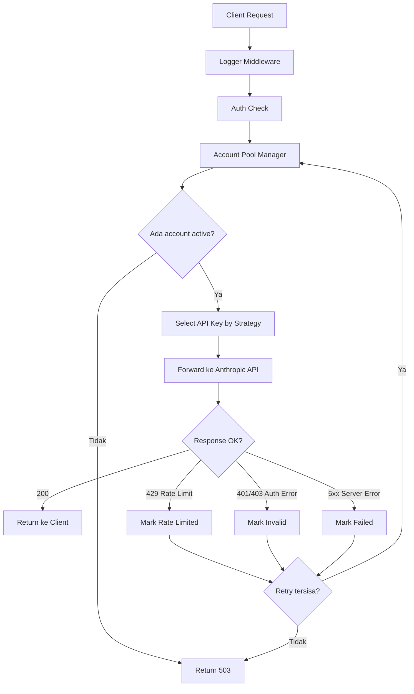
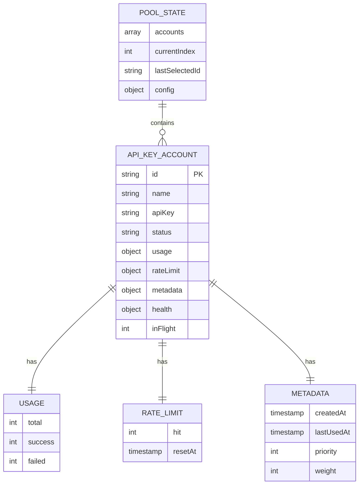

# claude-api

> Proxy server buat nge-pool multiple Anthropic API key dengan auto rotation, retry cerdas, dan monitoring dashboard. Terinspirasi dari arsitektur copilot-api.

[](https://github.com/el-pablos/claude-api/actions/workflows/ci.yml)


---

## kenapa perlu ini?

kalo kamu punya beberapa API key Anthropic dan pengen:

- **auto rotate** key saat kena rate limit
- **load balance** request ke multiple key
- **monitor** penggunaan tiap key dari dashboard
- **drop-in replacement** — cukup ganti `ANTHROPIC_BASE_URL` di Claude Code

maka ini solusinya.

---

## arsitektur

```
┌─────────────────────────────────────────────────┐
│                   Client                         │
│          (Claude Code / Anthropic SDK)           │
└────────────────────┬────────────────────────────┘
                     │
                     │  ANTHROPIC_BASE_URL=http://localhost:4143
                     ▼
┌─────────────────────────────────────────────────┐
│              claude-api proxy                    │
│                                                  │
│  ┌──────────┐  ┌──────────┐  ┌──────────┐      │
│  │  Logger   │→│   Auth   │→│  Error   │      │
│  │Middleware │  │Middleware│  │ Handler  │      │
│  └──────────┘  └──────────┘  └──────────┘      │
│                     │                            │
│           ┌─────────▼──────────┐                │
│           │   Account Pool     │                │
│           │     Manager        │                │
│           │                    │                │
│           │  ┌──┐ ┌──┐ ┌──┐  │                │
│           │  │K1│ │K2│ │K3│  │  ← API Keys    │
│           │  └──┘ └──┘ └──┘  │                │
│           │                    │                │
│           │  Strategies:       │                │
│           │  • round-robin     │                │
│           │  • weighted        │                │
│           │  • least-used      │                │
│           │  • priority        │                │
│           │  • random          │                │
│           └─────────┬──────────┘                │
│                     │                            │
│           ┌─────────▼──────────┐                │
│           │   Proxy Handler    │                │
│           │  + Retry Logic     │                │
│           └─────────┬──────────┘                │
└─────────────────────┼───────────────────────────┘
                      │
                      ▼
           ┌────────────────────┐
           │ api.anthropic.com  │
           └────────────────────┘
```

---

## flowchart request



---

## data model



---

## cara install

```bash
# clone repo
git clone https://github.com/el-pablos/claude-api.git
cd claude-api

# install dependencies
npm install

# copy env example
cp env.example .env

# edit .env — minimal set ENCRYPTION_KEY
# ENCRYPTION_KEY harus 32 karakter atau lebih

# jalankan development
npm run dev

# atau production
npm start
```

---

## cara pakai

### 1. tambah API key via dashboard

buka `http://localhost:4143/dashboard`, klik "Add Account", masukin:

- **Name**: label buat key (misal `work-key-1`)
- **API Key**: `sk-ant-api03-xxxxx`
- **Priority**: 1-100 (default 50)
- **Weight**: 1-10 (default 1)

### 2. atau via API

```bash
curl -X POST http://localhost:4143/api/dashboard/accounts \
  -H "Content-Type: application/json" \
  -H "Authorization: Bearer your-secret-key" \
  -d '{
    "name": "key-1",
    "apiKey": "sk-ant-api03-your-key-here",
    "priority": 50,
    "weight": 1
  }'
```

### 3. arahkan Claude Code ke proxy

```bash
# set environment variable
export ANTHROPIC_BASE_URL=http://localhost:4143
export ANTHROPIC_API_KEY=dummy-key

# jalankan Claude Code seperti biasa
claude
```

atau di config Claude Code:

```json
{
  "apiBaseUrl": "http://localhost:4143"
}
```

---

## konfigurasi

semua konfigurasi via environment variable:

| Variable              | Default                     | Deskripsi                                                                    |
| --------------------- | --------------------------- | ---------------------------------------------------------------------------- |
| `PORT`                | `4143`                      | Port server                                                                  |
| `HOST`                | `0.0.0.0`                   | Host binding                                                                 |
| `API_SECRET_KEY`      | -                           | Secret key untuk dashboard API                                               |
| `ENCRYPTION_KEY`      | -                           | Key enkripsi credential (min 32 chars)                                       |
| `POOL_STRATEGY`       | `round-robin`               | Strategi pool: `round-robin`, `weighted`, `least-used`, `priority`, `random` |
| `MAX_RETRIES`         | `3`                         | Max retry per request                                                        |
| `RATE_LIMIT_COOLDOWN` | `60000`                     | Cooldown rate limit (ms)                                                     |
| `CLAUDE_BASE_URL`     | `https://api.anthropic.com` | Target Anthropic API                                                         |
| `CLAUDE_API_TIMEOUT`  | `300000`                    | Timeout request (ms)                                                         |
| `DASHBOARD_ENABLED`   | `true`                      | Enable dashboard                                                             |
| `DASHBOARD_USERNAME`  | `admin`                     | Username dashboard                                                           |
| `DASHBOARD_PASSWORD`  | -                           | Password dashboard (kosong = no auth)                                        |

---

## pool strategies

### round-robin (default)

request didistribusi merata ke semua key secara berurutan. key yang rate limited otomatis di-skip.

### weighted

mirip round-robin tapi key dengan weight lebih tinggi dapat lebih banyak request. key dengan weight 3 dapat 3x lebih banyak dari weight 1.

### least-used

selalu pilih key yang paling sedikit sedang memproses request (in-flight). cocok kalau response time bervariasi.

### priority

selalu coba key dengan priority tertinggi dulu. turun ke priority lebih rendah kalau yang tinggi lagi not available.

### random

pilih key secara acak dari yang available. simple dan unpredictable.

---

## API reference

### proxy endpoints

| Method | Path           | Deskripsi                       |
| ------ | -------------- | ------------------------------- |
| `POST` | `/v1/messages` | Proxy ke Anthropic Messages API |
| `GET`  | `/v1/models`   | List available models           |

### health endpoints

| Method | Path               | Deskripsi                    |
| ------ | ------------------ | ---------------------------- |
| `GET`  | `/health`          | Simple health check          |
| `GET`  | `/health/detailed` | Detailed pool + metrics info |
| `GET`  | `/health/live`     | Kubernetes liveness probe    |
| `GET`  | `/health/ready`    | Kubernetes readiness probe   |

### dashboard API

| Method   | Path                                           | Deskripsi           |
| -------- | ---------------------------------------------- | ------------------- |
| `GET`    | `/api/dashboard/stats`                         | Pool statistics     |
| `GET`    | `/api/dashboard/accounts`                      | List semua account  |
| `GET`    | `/api/dashboard/accounts/:id`                  | Detail account      |
| `POST`   | `/api/dashboard/accounts`                      | Tambah account baru |
| `PUT`    | `/api/dashboard/accounts/:id`                  | Update account      |
| `DELETE` | `/api/dashboard/accounts/:id`                  | Hapus account       |
| `POST`   | `/api/dashboard/accounts/:id/disable`          | Disable account     |
| `POST`   | `/api/dashboard/accounts/:id/enable`           | Enable account      |
| `POST`   | `/api/dashboard/accounts/:id/reset-rate-limit` | Reset rate limit    |
| `GET`    | `/api/dashboard/metrics`                       | Real-time metrics   |
| `GET`    | `/api/dashboard/logs`                          | Recent request logs |
| `GET`    | `/api/dashboard/config`                        | Pool config         |
| `PUT`    | `/api/dashboard/config`                        | Update config       |

---

## testing

```bash
# semua test
npm test

# unit test aja
npm run test:unit

# dengan coverage
npm run test:coverage

# watch mode
npm run test:watch
```

---

## troubleshooting

**semua key kena rate limit**

- proxy return 503 dengan pesan "No available accounts in pool"
- tunggu cooldown period (default 60 detik) atau tambah key baru
- cek dashboard buat liat status tiap key

**key di-mark invalid**

- biasanya karena API key salah atau expired
- cek key di Anthropic Console
- enable kembali via dashboard setelah fix

**streaming tidak jalan**

- pastikan client support SSE
- proxy forward streaming response as-is dari Anthropic

**dashboard tidak bisa diakses**

- cek `DASHBOARD_ENABLED=true`
- kalau pake password, set `DASHBOARD_PASSWORD` di .env

---

## development

```bash
# dev mode (auto-reload)
npm run dev

# typecheck
npm run typecheck

# build
npm run build
```

---

## tech stack

- **Runtime**: Node.js 20+
- **Framework**: Hono
- **Language**: TypeScript
- **Testing**: Vitest
- **Dashboard**: Alpine.js + Tailwind CSS + Chart.js
- **CI/CD**: GitHub Actions

---

## kontributor

|     | Nama          | Role                 |
| --- | ------------- | -------------------- |
|     | **el-pablos** | Creator & Maintainer |

---

## license

MIT License - bebas dipakai, dimodifikasi, dan didistribusikan.
