<div align="center">

# claude-api

### Proxy Pool buat Claude OAuth Session — Auto Rotation, Auto Refresh, Auto Failover

<br>

<p>


</p>

<p>


</p>

<p>


</p>

<br>

<p><b>
<a href="#-deskripsi-proyek">Deskripsi</a> ·
<a href="#-arsitektur-proyek">Arsitektur</a> ·
<a href="#-quick-start">Quick Start</a> ·
<a href="#-tour-dashboard">Dashboard Tour</a> ·
<a href="#-oauth-flow-pkce">OAuth Flow</a> ·
<a href="#-api-reference">API</a> ·
<a href="#-deployment">Deploy</a> ·
<a href="#-testing--ci-cd">Testing</a> ·
<a href="#-kontributor">Kontributor</a>
</b></p>

<br>

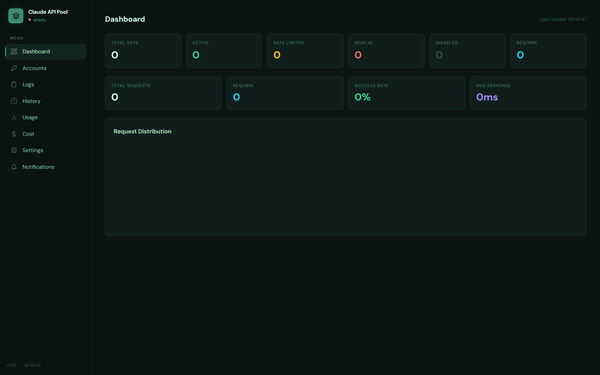

</div>

---

## Daftar Isi

1. [Deskripsi proyek](#-deskripsi-proyek)
2. [Penjelasan keseluruhan](#-penjelasan-keseluruhan)
3. [Arsitektur proyek](#-arsitektur-proyek)
4. [Diagram & flowchart](#-diagram--flowchart)
5. [Quick Start](#-quick-start)
6. [Tour Dashboard (semua page + screenshot)](#-tour-dashboard)
7. [OAuth flow PKCE](#-oauth-flow-pkce)
8. [API Reference](#-api-reference)
9. [Pool strategies](#-pool-strategies)
10. [Configuration](#-configuration)
11. [Deployment](#-deployment)
12. [Testing & CI/CD](#-testing--ci-cd)
13. [Troubleshooting](#-troubleshooting)
14. [Statistik repository](#-statistik-repository)
15. [Kontributor](#-kontributor)
16. [License](#-license)

---

## Deskripsi proyek

`claude-api` itu **proxy server** yang fungsinya nge-pool banyak akun Claude (OAuth session) jadi satu endpoint yang kelihatan kayak Claude API biasa. Dia duduk di antara client kamu (bisa Claude Code, Anthropic SDK, atau curl biasa) dan server resmi Anthropic.

> **TL;DR**: punya 5 akun Claude? proxy ini bakal rotate request ke semua akun secara otomatis. Akun yang kena rate limit di-bypass, akun yang token-nya expired di-refresh otomatis, akun yang gagal terus-terusan di-mark invalid. Client kamu nggak perlu tau apa-apa, cuma kelihatan kayak satu API yang nggak pernah down.

Inspirasi-nya datang dari pattern proxy pool yang udah lama dipakai di komunitas — kayak [`copilot-api`](https://github.com/ericc-ch/copilot-api) buat GitHub Copilot — tapi di sini di-adopsi ke ekosistem Anthropic dengan **autentikasi OAuth 2.0 PKCE** (bukan API key statis lagi).

### Apa yang bikin proyek ini beda

- **OAuth 2.0 PKCE login** — login langsung pake akun Claude personal kamu, **gak pake API key**. Token di-encrypt sebelum disimpan.
- **Token auto-refresh** — background job yang ngecek tiap 30 detik, kalo ada token yang mau expired (60 detik buffer), langsung di-refresh tanpa downtime.
- **Smart pool dengan 5 strategy** — round-robin, weighted, least-used, priority, random. Tinggal switch dari dashboard.
- **Auto failover** — request kena 429? Auto-rotate ke akun lain dalam request yang sama. Client gak pernah liat error.
- **Encrypted at rest** — OAuth tokens di-encrypt pake AES-256-GCM sebelum disimpan ke `data/pool.json`.
- **Real-time monitoring dashboard** — 8 tab (Dashboard, Accounts, Logs, History, Usage, Cost, Settings, Notifications) dengan chart, SSE log stream, dan account management.
- **Usage & cost tracking** — track token usage dan estimate cost per akun, per model, per hari, lengkap.
- **Drop-in replacement** — cukup ganti `ANTHROPIC_BASE_URL` di Claude Code, langsung lewat proxy. Zero changes ke aplikasi kamu.
- **Battle-tested** — 205 unit test, typecheck strict, CI/CD auto-release tiap push.

### Cocok buat siapa

- Developer yang punya beberapa akun Claude dan mau pool-in semuanya jadi satu API yang reliable.
- Tim kecil yang share resource Claude buat development & coding agents (Claude Code).
- Researcher / power user yang sering kena 429 karena workload tinggi.
- Siapa aja yang males ngurusin token refresh manual atau switching akun manual.

---

## Penjelasan keseluruhan

`claude-api` ditulis full pakai **TypeScript strict mode** di atas runtime **Node.js 22+** dengan framework HTTP **[Hono](https://hono.dev/)** yang super lightweight (zero deps di runtime). Arsitekturnya modular — tiap concern punya file sendiri di `src/lib/` dan `src/routes/`. Storage state-nya pake JSON file biasa (di-encrypt buat secret-nya), nggak butuh database eksternal.

Workflow request standar gini:

1. Client (misal Claude Code) ngirim request ke `http://localhost:4143/v1/messages`.
2. Middleware logger nge-log request, error handler standby buat catch exception.
3. Middleware auth ngecek `Authorization: Bearer <secret>` atau `x-api-key: <secret>` (kalo `API_SECRET_KEY` ke-set).
4. Proxy handler nge-call `accountManager.getNextAccount()` — sesuai strategy yang aktif, dia pilih akun yang available.
5. Kalo token akun itu mau expired, di-refresh dulu pake `oauth.refreshAccessToken()`.
6. Request di-forward ke `https://api.anthropic.com/v1/messages` dengan `Authorization: Bearer <oauth-access-token>` plus header tambahan `anthropic-beta: oauth-2025-04-20,claude-code-20250219`.
7. Response dari Anthropic di-parse, kalo 429 → mark akun rate-limited, retry pake akun lain. Kalo 401/403 → mark invalid, retry. Kalo 5xx → retry sampai `MAX_RETRIES`.
8. Sukses? Return response ke client + record usage (input/output tokens, cache hits) + record cost.
9. Background jobs jalan paralel: rate-limit recovery (5s), health check (60s), state persistence (10s), token refresh (30s).

Tiap modul punya tanggung jawab sendiri:

| Modul | File | Tanggung jawab |
|---|---|---|
| Config loader | `src/lib/config.ts` | Parse env, validate strategy, default values |
| OAuth | `src/lib/oauth.ts` | PKCE challenge, authorize URL, token exchange, refresh |
| Account Manager | `src/lib/account-manager.ts` | Pool state, CRUD account, encryption, lifecycle events |
| Pool Strategy | `src/lib/pool-strategy.ts` | 5 algoritma rotation |
| Proxy Handler | `src/lib/proxy.ts` | Forward request, retry, rate-limit, usage extract |
| Crypto | `src/lib/crypto.ts` | AES-256-GCM encrypt/decrypt token |
| Storage | `src/lib/storage.ts` | Persist state ke disk dengan debounce |
| Retry | `src/lib/retry.ts` | Exponential backoff, retry-after parsing |
| Metrics | `src/lib/metrics.ts` | In-memory rolling stats (rpm, avg response time) |
| Usage Tracker | `src/lib/usage-tracker.ts` | Token usage per request |
| Cost Calculator | `src/lib/cost-calculator.ts` | Pricing table 6 model + daily cost |
| Logger | `src/lib/logger.ts` | Structured JSON log + level filter |
| Notification | `src/lib/notification-center.ts` | In-memory notif buat dashboard |
| Request History | `src/lib/request-history.ts` | Ring buffer last N requests |

Semua route HTTP di-pisah:

| Route | File | Endpoint |
|---|---|---|
| Proxy API | `src/routes/api.ts` | `/v1/messages`, `/v1/models` |
| Health | `src/routes/health.ts` | `/health`, `/ready` |
| Dashboard UI | `src/routes/dashboard.ts` | `GET /dashboard` (Alpine.js SPA) |
| Dashboard API | `src/routes/dashboard-api.ts` | CRUD akun, OAuth start/exchange, config |
| Log Stream | `src/routes/log-stream.ts` | `GET /api/dashboard/logs/stream` (SSE) |
| History API | `src/routes/history-api.ts` | `/api/dashboard/history*` |
| Notifications | `src/routes/notifications-api.ts` | `/api/dashboard/notifications*` |
| Usage API | `src/routes/usage-api.ts` | `/api/dashboard/usage`, `/cost` |

---

## Arsitektur proyek

### Diagram tingkat tinggi

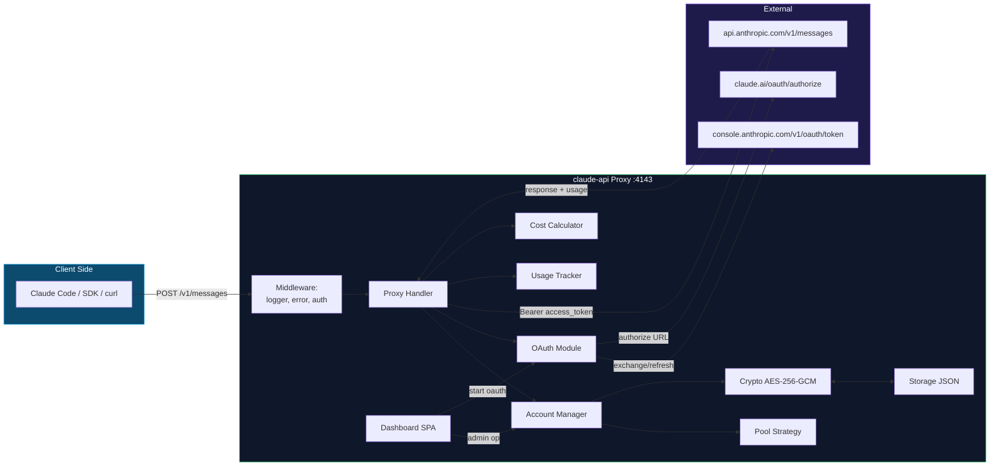

### Layer breakdown

```
┌──────────────────────────────────────────────────────────┐
│                    PRESENTATION LAYER                     │
│  ┌────────────────┐  ┌─────────────────────────────────┐ │
│  │  Dashboard SPA │  │  REST API + SSE                 │ │
│  │  (Alpine.js)   │  │  /v1/*, /api/dashboard/*        │ │
│  └────────────────┘  └─────────────────────────────────┘ │
├──────────────────────────────────────────────────────────┤
│                    APPLICATION LAYER                      │
│  ┌──────────┐  ┌──────────┐  ┌──────────┐  ┌──────────┐ │
│  │ Routes/  │  │Middleware│  │  Proxy   │  │Notifica- │ │
│  │Handlers  │  │   stack  │  │  Handler │  │tion Hub  │ │
│  └──────────┘  └──────────┘  └──────────┘  └──────────┘ │
├──────────────────────────────────────────────────────────┤
│                       DOMAIN LAYER                        │
│  ┌──────────┐  ┌──────────┐  ┌──────────┐  ┌──────────┐ │
│  │ Account  │  │  OAuth   │  │  Pool    │  │  Usage/  │ │
│  │ Manager  │  │  Module  │  │ Strategy │  │   Cost   │ │
│  └──────────┘  └──────────┘  └──────────┘  └──────────┘ │
├──────────────────────────────────────────────────────────┤
│                  INFRASTRUCTURE LAYER                     │
│  ┌──────────┐  ┌──────────┐  ┌──────────┐  ┌──────────┐ │
│  │  Crypto  │  │ Storage  │  │  Logger  │  │ Metrics  │ │
│  │  (GCM)   │  │  (JSON)  │  │ (struct) │  │ (rolling)│ │
│  └──────────┘  └──────────┘  └──────────┘  └──────────┘ │
└──────────────────────────────────────────────────────────┘
```

### Folder structure

```
claude-api/
├── .github/workflows/ci.yml      # CI/CD: test, build, auto-release
├── data/                          # pool state (gitignored)
├── docs/screenshots/              # 9 dashboard screenshots
├── logs/                          # runtime logs (gitignored)
├── scripts/screenshots.mjs        # playwright screenshot helper
├── src/
│   ├── dashboard/index.html       # Alpine.js SPA single-file
│   ├── lib/                       # 15 domain modules
│   ├── middleware/                # auth, logger, error
│   ├── routes/                    # 8 route files
│   └── index.ts                   # entrypoint, wiring semua modul
├── tests/unit/lib/                # 10 test file, 205 tests
├── Dockerfile + docker-compose.yml
├── package.json + tsconfig.json
└── README.md
```

---

## Diagram & flowchart

### 1. Request flow + auto failover (flowchart)

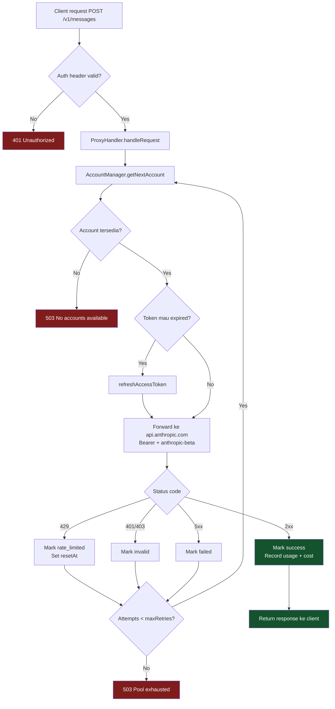

### 2. OAuth PKCE flow (sequence diagram)

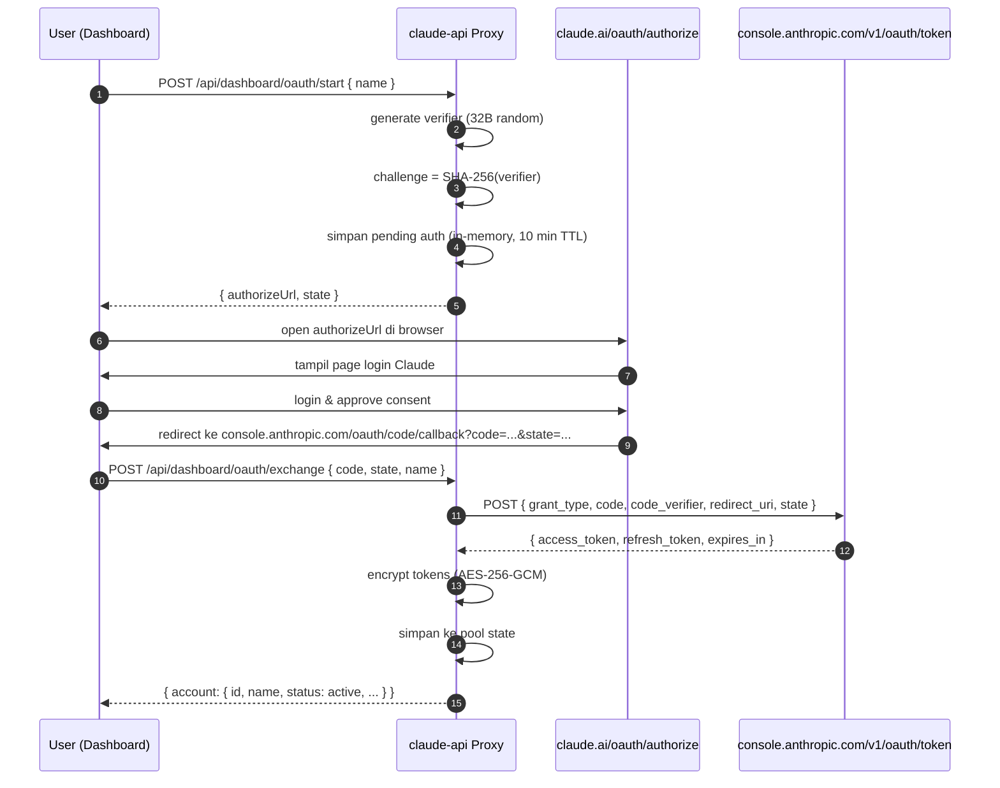

### 3. State diagram tiap akun (lifecycle ERD-ish)

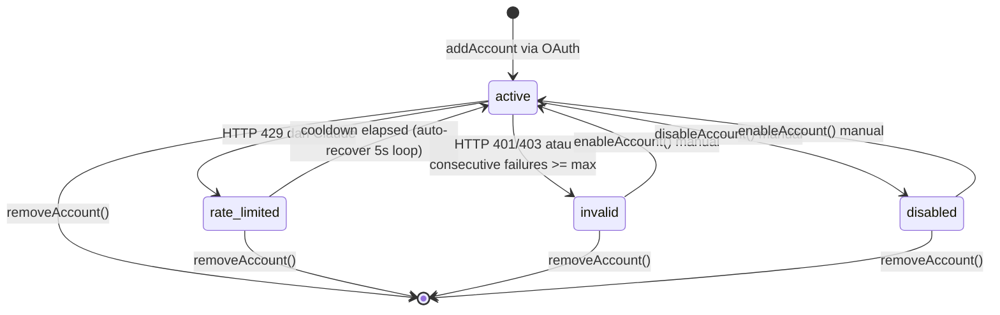

### 4. Data model (ERD-style)

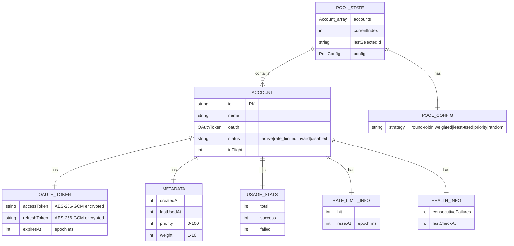

---

## Quick Start

### Pakai Docker (paling cepat)

```bash
git clone https://github.com/el-pablos/claude-api.git
cd claude-api

# generate encryption key & dashboard password
echo "ENCRYPTION_KEY=$(openssl rand -hex 16)" > .env
echo "DASHBOARD_PASSWORD=ganti-password-ini" >> .env

# fire it up
docker compose up -d
```

Buka `http://localhost:4143/dashboard` di browser → klik **Add Account** → login pake akun Claude → done. Akun masuk pool, langsung bisa dipake.

### Native install (Node 22+)

```bash
git clone https://github.com/el-pablos/claude-api.git
cd claude-api
npm install
copy env.example .env   # macOS/Linux: cp env.example .env
# edit .env: set ENCRYPTION_KEY minimal 32 char

npm run dev   # development (auto-reload)
# atau
npm start     # production
```

### Pakai claude-api dari Claude Code

Tinggal set env variable:

```bash
# Windows PowerShell
$env:ANTHROPIC_BASE_URL = "http://localhost:4143"
$env:ANTHROPIC_API_KEY = "your-API_SECRET_KEY-from-.env"   # opsional
claude   # jalanin Claude Code

# macOS/Linux
export ANTHROPIC_BASE_URL=http://localhost:4143
export ANTHROPIC_API_KEY=your-API_SECRET_KEY-from-.env
claude
```

Claude Code bakal request ke `http://localhost:4143/v1/messages` → proxy nge-pool ke akun-akun Claude kamu otomatis.

---

## Tour Dashboard

Dashboard di `http://localhost:4143/dashboard` punya **8 tab utama**. Semua real-time, auto-refresh, dan bisa di-control via API juga.

### 1. Dashboard tab — overview pool


Stats card overview: total keys, active, rate-limited, invalid, disabled, req/min. Plus chart request distribution per akun. Cocok buat ngintip kondisi pool dalam 1 layar.

### 2. Accounts tab — pool command center

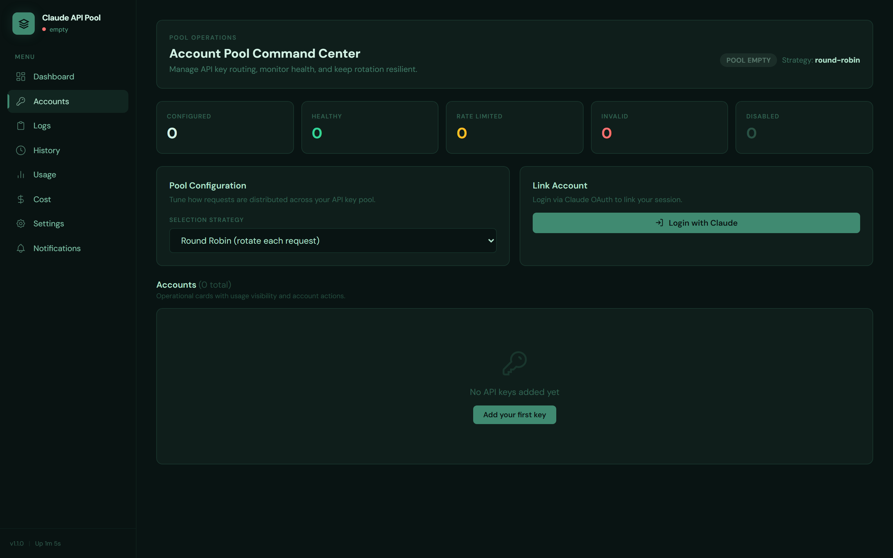

Manage semua OAuth session di sini. Tiap card akun punya tombol: **Disable**, **Enable**, **Reset Rate Limit**, **Refresh Token**, **Remove**. Pool strategy bisa di-switch dari dropdown — change langsung berlaku tanpa restart.

### 3. Add Account modal — OAuth login flow

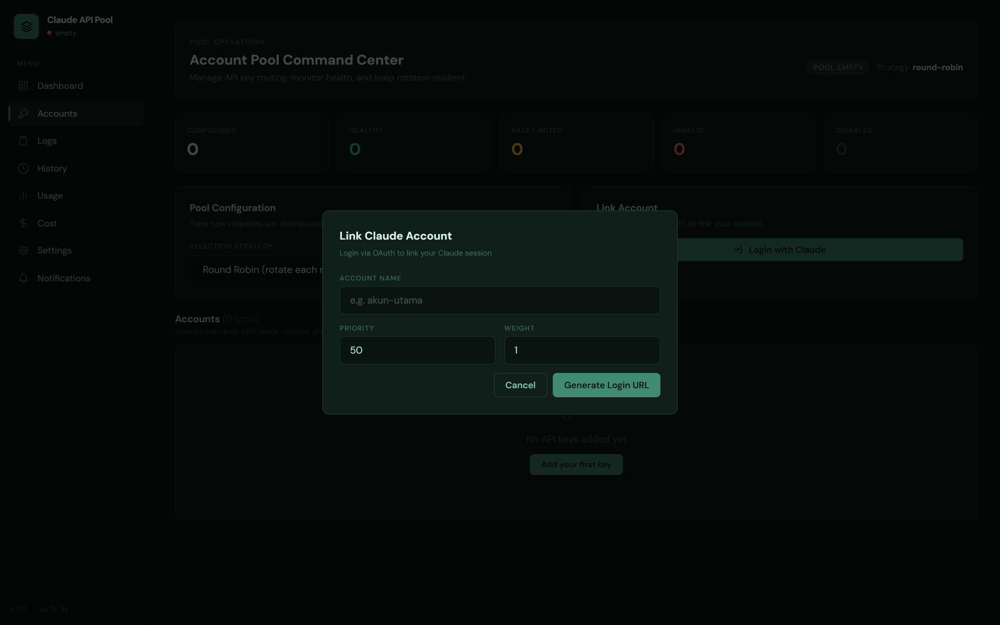

Modal 2-step buat link akun Claude baru. Step 1: kasih nama akun + priority/weight. Step 2: klik tombol → buka authorize URL di browser → login → copy code → paste balik ke modal → done.

### 4. Logs tab — SSE live log streaming

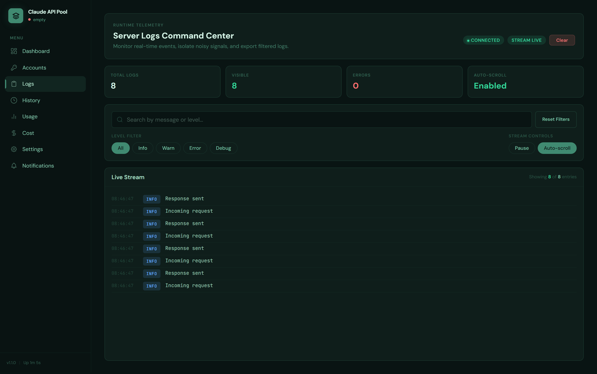

Server-Sent Events streaming log real-time. Filter by level (debug, info, warn, error), search by keyword, pause/resume stream. Useful banget buat debug kalo ada request yang nyangkut.

### 5. History tab — request history

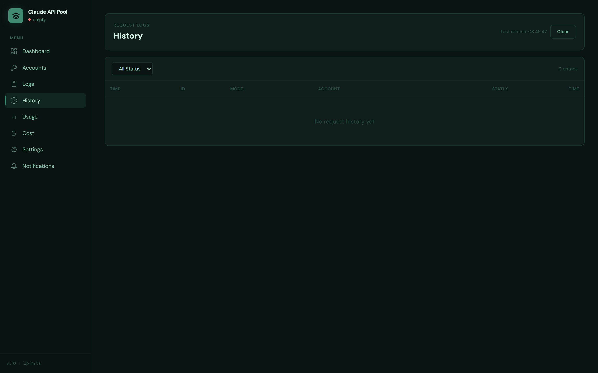

Last N request lengkap: timestamp, model, method, path, status code, response time, akun yang dipake, input/output tokens, apakah dari cache. Pagination + filter built-in.

### 6. Usage tab — token usage analytics

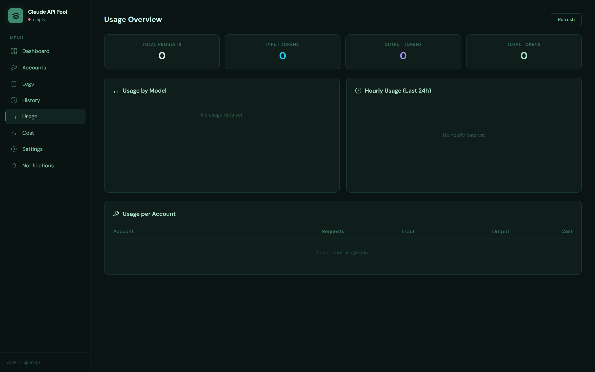

Breakdown token usage by model + by account. Hourly chart (24 jam terakhir). Cache hit rate. Total input/output token. Cocok buat ngitung berapa banyak resource yang udah dipake tiap akun.

### 7. Cost tab — cost estimation

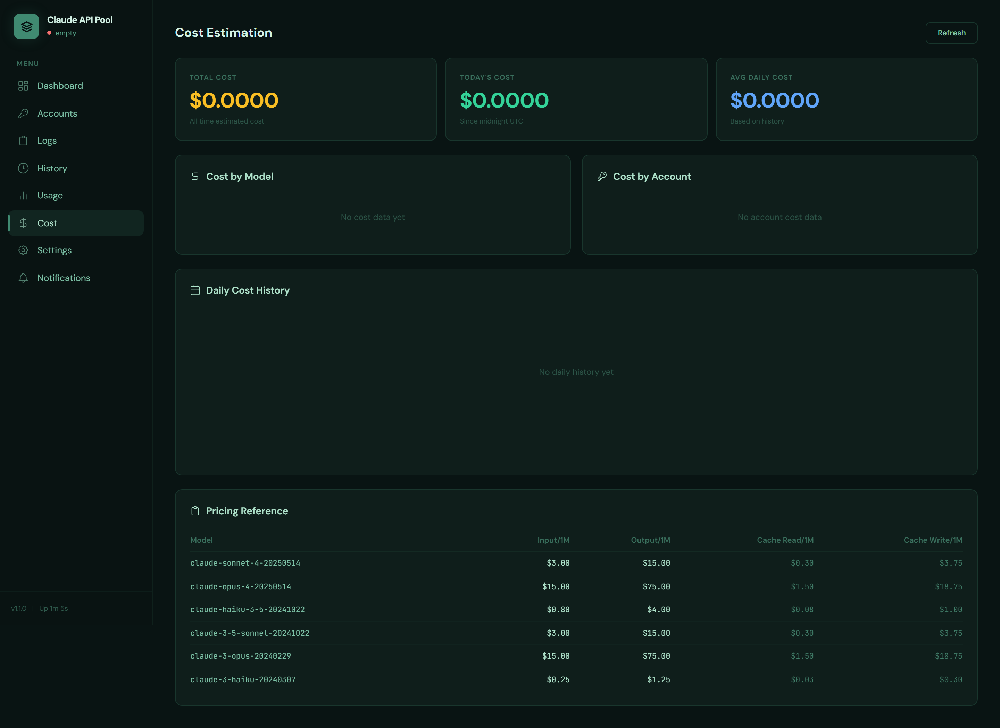

Cost calculator pake Anthropic pricing table terbaru (Sonnet 4.5, Opus 4, Haiku 3.5, dll). Breakdown by model, daily history, total cost estimate. Pricing-nya hardcoded dari `cost-calculator.ts` jadi gampang update kalo Anthropic ubah harga.

### 8. Settings tab — runtime config

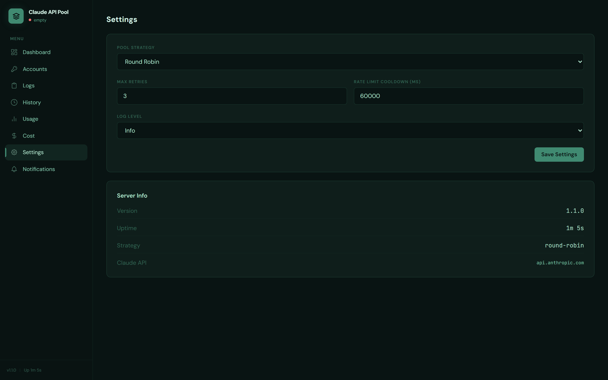

Edit config tanpa restart: pool strategy, max retries, rate limit cooldown, log level. Disimpan in-memory + di-persist. Kalo butuh persistent permanen, tetap edit `.env` + restart.

### 9. Notifications tab — alert center

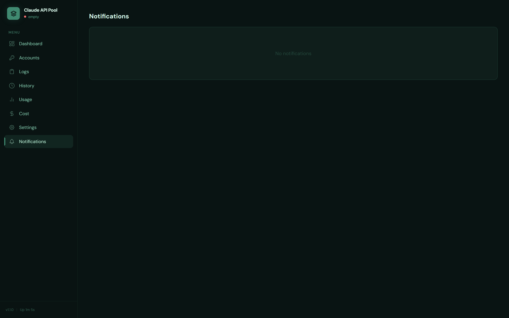

Notif otomatis kalo ada event penting: akun kena rate limit, akun di-mark invalid, akun recovered. Mark as read, clear all, atau filter by type (success/warning/error).

---

## OAuth flow PKCE

Login pake OAuth 2.0 PKCE (Proof Key for Code Exchange) langsung dari akun Claude personal. Aman karena nggak perlu client secret di sisi proxy — pake code verifier yang di-hash SHA-256.

### Endpoint OAuth yang dipake

| Endpoint | Tujuan |
|---|---|
| `https://claude.ai/oauth/authorize` | Halaman consent buat user login & approve |
| `https://console.anthropic.com/v1/oauth/token` | Exchange code → tokens, refresh token |
| `https://console.anthropic.com/oauth/code/callback` | Redirect URI (page yang nampilin code buat di-copy) |

### Scopes

```
org:create_api_key user:profile user:inference
```

### Flow lengkap

1. **User trigger** — klik "Add Account" di dashboard atau `POST /api/dashboard/oauth/start`.
2. **Generate PKCE** — proxy bikin random `code_verifier` (32 byte base64url), hitung `code_challenge = SHA256(verifier)`, plus `state` random.
3. **Build authorize URL** — pake `encodeURIComponent` manual buat semua param (penting: spasi jadi `%20`, bukan `+` — fix bug "Missing redirect_uri parameter"). Format:
    ```
    https://claude.ai/oauth/authorize?
      code=true&
      client_id=9d1c250a-e61b-44d9-88ed-5944d1962f5e&
      response_type=code&
      redirect_uri=https%3A%2F%2Fconsole.anthropic.com%2Foauth%2Fcode%2Fcallback&
      scope=org%3Acreate_api_key%20user%3Aprofile%20user%3Ainference&
      code_challenge=<base64url>&
      code_challenge_method=S256&
      state=<random>
    ```
4. **User browse + login** — buka URL di browser, login Claude, klik approve.
5. **Redirect to callback** — Claude redirect ke `console.anthropic.com/oauth/code/callback` dengan `?code=...&state=...`. Page itu nampilin code buat di-copy.
6. **User paste back** — copy `code#state` (atau full URL), paste ke dashboard atau `POST /api/dashboard/oauth/exchange`.
7. **Exchange code → tokens** — proxy POST ke `https://console.anthropic.com/v1/oauth/token` dengan body JSON:
    ```json
    {
      "grant_type": "authorization_code",
      "code": "...",
      "client_id": "9d1c250a-...",
      "code_verifier": "...",
      "redirect_uri": "https://console.anthropic.com/oauth/code/callback",
      "state": "..."
    }
    ```
8. **Encrypt + persist** — `access_token` & `refresh_token` di-encrypt AES-256-GCM, disimpan ke `data/pool.json` bareng metadata akun.
9. **Auto-refresh** — background job tiap 30 detik ngecek `expiresAt`, kalo dalam 60 detik buffer → refresh otomatis.

---

## API Reference

### Proxy endpoints (auth pake `Authorization: Bearer <API_SECRET_KEY>` atau `x-api-key`)

| Method | Path | Deskripsi |
|---|---|---|
| `POST` | `/v1/messages` | Forward ke Claude Messages API, auto-rotate akun |
| `GET` | `/v1/models` | Forward ke Claude Models API |

### Dashboard API (auth pake Basic auth kalo `DASHBOARD_PASSWORD` di-set, atau open kalo nggak)

| Method | Path | Deskripsi |
|---|---|---|
| `GET` | `/api/dashboard/stats` | Pool metrics (active/rate-limited/invalid count, rpm, dll) |
| `GET` | `/api/dashboard/accounts` | List semua akun (oauth tokens di-mask) |
| `GET` | `/api/dashboard/accounts/:id` | Detail satu akun |
| `POST` | `/api/dashboard/oauth/start` | Generate PKCE + authorize URL |
| `POST` | `/api/dashboard/oauth/exchange` | Exchange code → tokens, simpan ke pool |
| `GET` | `/api/dashboard/oauth/pending` | Count pending OAuth flow |
| `POST` | `/api/dashboard/accounts/:id/refresh-token` | Manual refresh token |
| `PUT` | `/api/dashboard/accounts/:id` | Update name/priority/weight |
| `DELETE` | `/api/dashboard/accounts/:id` | Remove akun dari pool |
| `POST` | `/api/dashboard/accounts/:id/disable` | Disable akun |
| `POST` | `/api/dashboard/accounts/:id/enable` | Enable akun |
| `POST` | `/api/dashboard/accounts/:id/reset-rate-limit` | Reset rate limit manual |
| `GET` | `/api/dashboard/config` | Get runtime config |
| `PUT` | `/api/dashboard/config` | Update runtime config (strategy, log level, dll) |
| `GET` | `/api/dashboard/logs` | Last N log entries |
| `GET` | `/api/dashboard/logs/stream` | SSE log stream realtime |
| `GET` | `/api/dashboard/history` | Request history dengan pagination |
| `GET` | `/api/dashboard/history/stats` | Aggregate stats dari history |
| `GET` | `/api/dashboard/notifications` | List notifications |
| `GET` | `/api/dashboard/usage` | Usage breakdown (model, account, hourly) |
| `GET` | `/api/dashboard/cost` | Cost breakdown dengan daily history |
| `GET` | `/api/dashboard/status` | Compact status (uptime, version, total/active accounts) |

### Health endpoints (no auth)

| Method | Path | Deskripsi |
|---|---|---|
| `GET` | `/health` | Liveness probe — `{ "status": "ok" }` |
| `GET` | `/ready` | Readiness probe — cek pool ada akun active |

### Contoh request curl

```bash
# minta completion via proxy
curl -X POST http://localhost:4143/v1/messages \
  -H "Authorization: Bearer your-API_SECRET_KEY" \
  -H "Content-Type: application/json" \
  -d '{
    "model": "claude-sonnet-4-5",
    "max_tokens": 1024,
    "messages": [{"role": "user", "content": "halo"}]
  }'

# generate OAuth login URL
curl -X POST http://localhost:4143/api/dashboard/oauth/start \
  -H "Content-Type: application/json" \
  -d '{"name":"akun-utama"}'

# exchange OAuth code
curl -X POST http://localhost:4143/api/dashboard/oauth/exchange \
  -H "Content-Type: application/json" \
  -d '{"code":"abc123#statexyz","name":"akun-utama"}'
```

---

## Pool strategies

5 algoritma rotation, semua-nya di `src/lib/pool-strategy.ts`. Switch via dashboard atau `PUT /api/dashboard/config`.

| Strategy | Cara kerja | Kapan dipake |
|---|---|---|
| **round-robin** *(default)* | Rotate berurutan: A → B → C → A → B → C | Pool seimbang, akun setara |
| **weighted** | Pilih random tapi probabilitas berdasarkan `weight` (default 1) | Akun premium dapet lebih banyak request |
| **least-used** | Pilih akun dengan `usage.total` terkecil | Pemerataan beban historis |
| **priority** | Pilih akun dengan `priority` tertinggi (0-100) yang masih active | Punya akun primary & fallback |
| **random** | Pure random dari yang active | Distribusi natural, no pattern |

Semua strategy **skip otomatis** akun yang `status !== "active"`. Jadi kalo ada yang rate-limited/invalid/disabled, langsung di-bypass.

---

## Configuration

Semua via env variable. Lihat `env.example` buat referensi lengkap.

| Variable | Default | Deskripsi |
|---|---|---|
| `PORT` | `4143` | Port HTTP server |
| `HOST` | `0.0.0.0` | Bind address |
| `NODE_ENV` | `development` | `development` / `production` |
| `API_SECRET_KEY` | *(empty)* | Kalo set, request `/v1/*` butuh auth header |
| `ENCRYPTION_KEY` | *(required)* | Min 32 char, buat encrypt OAuth tokens |
| `POOL_STRATEGY` | `round-robin` | Default strategy |
| `POOL_STATE_FILE` | `./data/pool.json` | Path persist state |
| `POOL_HEALTH_CHECK_INTERVAL` | `60000` | ms |
| `RATE_LIMIT_COOLDOWN` | `60000` | ms cooldown setelah 429 (kalo gak ada `Retry-After`) |
| `RATE_LIMIT_MAX_CONSECUTIVE` | `5` | Auto-invalidate setelah N consecutive failures |
| `MAX_RETRIES` | `3` | Per-request retry budget |
| `RETRY_DELAY_BASE` | `1000` | Base ms exponential backoff |
| `RETRY_DELAY_MAX` | `30000` | Cap ms backoff |
| `CLAUDE_BASE_URL` | `https://api.anthropic.com` | Upstream Claude API |
| `CLAUDE_API_TIMEOUT` | `300000` | ms timeout per upstream call |
| `LOG_LEVEL` | `info` | `debug` / `info` / `warn` / `error` |
| `DASHBOARD_ENABLED` | `true` | Toggle dashboard route |
| `DASHBOARD_USERNAME` | `admin` | Basic auth username |
| `DASHBOARD_PASSWORD` | *(empty)* | Kalo set, dashboard butuh basic auth |

---

## Deployment

### Docker compose (recommended)

`docker-compose.yml` udah ada — tinggal `docker compose up -d`. Volume persistent untuk `data/` dan `logs/`.

```bash
# build & jalanin
docker compose up -d --build

# liat logs
docker compose logs -f claude-api

# stop
docker compose down

# clean total (hapus volume)
docker compose down -v
```

### VPS dengan PM2

```bash
git clone https://github.com/el-pablos/claude-api.git
cd claude-api
npm ci
npm run build
echo "ENCRYPTION_KEY=$(openssl rand -hex 16)" > .env
echo "DASHBOARD_PASSWORD=$(openssl rand -hex 12)" >> .env

npm i -g pm2
pm2 start npm --name claude-api -- start
pm2 save
pm2 startup   # ikutin instruksi yang muncul
```

Reverse proxy via Nginx + HTTPS:

```nginx
server {
    listen 443 ssl http2;
    server_name claude-api.kamu.dev;

    ssl_certificate     /etc/letsencrypt/live/claude-api.kamu.dev/fullchain.pem;
    ssl_certificate_key /etc/letsencrypt/live/claude-api.kamu.dev/privkey.pem;

    location / {
        proxy_pass http://localhost:4143;
        proxy_http_version 1.1;
        proxy_set_header Host $host;
        proxy_set_header X-Real-IP $remote_addr;
        proxy_buffering off;          # SSE & streaming
        proxy_read_timeout 5m;
        proxy_send_timeout 5m;
    }
}
```

### Windows native

```powershell
# install Node 22+ dari nodejs.org
node --version   # cek 22+
npm --version

# clone & install
git clone https://github.com/el-pablos/claude-api.git
cd claude-api
npm install

# bikin .env (PowerShell-friendly)
copy env.example .env
notepad .env   # set ENCRYPTION_KEY (min 32 char)

# dev (auto-reload)
npm run dev
```

Buat run sebagai Windows service, pake `node-windows` atau jalanin lewat Task Scheduler dengan trigger "At startup".

---

## Testing & CI/CD

### Test suite

**205 unit tests, 100% passed**, coverage tracked via vitest.

```bash
npm test                  # all 205 tests
npm run test:unit         # cuma tests/unit/
npm run test:coverage     # generate coverage/
npm run test:watch        # watch mode
npm run typecheck         # tsc --noEmit
```

Breakdown test files:

| File | Tests | Fokus |
|---|---|---|
| `oauth.test.ts` | 40 | PKCE, build URL, exchange, refresh, parse code |
| `account-manager.test.ts` | 46 | CRUD account, lifecycle, encryption, events |
| `pool-strategy.test.ts` | 33 | 5 strategy algorithms |
| `cost-calculator.test.ts` | 20 | Pricing 6 model, daily cost, breakdown |
| `usage-tracker.test.ts` | 17 | Token tracking, aggregation, hourly buckets |
| `crypto.test.ts` | 13 | AES-256-GCM round-trip, edge cases |
| `metrics.test.ts` | 12 | Rolling window, rpm, avg response time |
| `retry.test.ts` | 10 | Backoff, retry-after, classifier |
| `storage.test.ts` | 8 | Persist, load, corrupt, debounce |
| `config.test.ts` | 6 | Env parsing, validation, defaults |

### CI/CD pipeline (`.github/workflows/ci.yml`)

Trigger di **push** ke `main` / `testing`, **pull request**, atau manual via `workflow_dispatch`. 3 job:

1. **`test`** — matrix Node 20 + 22, install deps, typecheck, jalanin tests, upload coverage artifact (Node 22 only).
2. **`docker`** — kalo push, build Docker image dengan tag `latest` + commit SHA, pakai GHA cache.
3. **`release`** — kalo push, generate tag `vX.Y.Z.{commit-count}` (atau `vX.Y.Z.{commit-count}-testing` buat branch testing), bikin GitHub Release. `main` → `make_latest=true`. `testing` → `prerelease=true`.

Tagging scheme jadi:

```
main:    v1.1.0.42       (latest stable)
testing: v1.1.0.43-testing (prerelease)
```

Gampang banget tracking versi based on commit count — naik 1 tiap push.

---

## Troubleshooting

**OAuth error "Invalid OAuth Request" / "Missing redirect_uri parameter"**
Pastikan `oauth.ts` pake endpoint terbaru: `claude.ai/oauth/authorize` + `console.anthropic.com/v1/oauth/token` + `console.anthropic.com/oauth/code/callback`. Plus `buildAuthorizeUrl()` harus pake `encodeURIComponent` manual (spasi → `%20`, bukan `+`).

**"No available accounts in pool" (HTTP 503)**
Semua akun di pool lagi rate-limited / invalid / disabled. Cek dashboard tab Accounts. Bisa juga belum nambahin akun.

**Token refresh failed**
Refresh token kemungkinan udah revoked dari sisi Claude (logout dari device list, expired, dll). Solusi: `removeAccount` lalu link ulang via OAuth.

**Dashboard 401 Unauthorized**
`DASHBOARD_PASSWORD` di-set tapi belum input basic auth. Buka di browser → input `DASHBOARD_USERNAME` + `DASHBOARD_PASSWORD` dari `.env`.

**Encryption error saat load state**
`ENCRYPTION_KEY` ganti antara restart? Token lama gak bisa di-decrypt. Solusi: hapus `data/pool.json`, link ulang akun.

**Docker container exit immediately**
Cek `docker compose logs claude-api`. Biasanya `ENCRYPTION_KEY` belum di-set atau kurang dari 32 char.

**Claude Code masih ngaku ke api.anthropic.com asli**
Pastikan env `ANTHROPIC_BASE_URL` di-set sebelum jalanin `claude`. Cek dengan `echo $ANTHROPIC_BASE_URL` (atau `$env:ANTHROPIC_BASE_URL` di PowerShell).

---

## Statistik repository

<div align="center">


<br><br>

| Metric | Nilai |
|---|---|
| Test count | **205** ✅ |
| Test coverage | tracked via vitest c8 |
| TypeScript | strict mode |
| Lines of code | ~5,500 (src + tests) |
| Modules (`src/lib/`) | 15 |
| Routes (`src/routes/`) | 8 |
| Middleware | 3 |
| Dashboard tabs | 8 (1 SPA file) |
| Pool strategies | 5 |
| Background jobs | 4 (recovery, health, persist, refresh) |
| OAuth scopes | 3 |
| Supported models | 6 (Sonnet 4.5, Opus 4, Haiku 3.5, dll) |

</div>

---

## Kontributor

<div align="center">

<table>
<tr>
<td align="center">
<a href="https://github.com/el-pablos">

<br><b>el-pablos</b>
</a>
<br>
<sub>Maintainer · Architect · Lead Dev</sub>
<br><br>
<a href="https://github.com/el-pablos/claude-api/commits?author=el-pablos">

</a>
<a href="https://github.com/el-pablos">

</a>
</td>
</tr>
</table>

<br>

**Mau kontribusi?** Open issue dulu buat diskusi, baru bikin PR. Format commit ngikutin convention:

```
add: tambahin fitur X
fix: benerin bug Y
update: refactor module Z
remove: hapus dead code A
docs: update readme B
test: tambahin test C
improve: optimize D
```

Bahasa Indonesia kasual, 1 baris aja, lugas tapi detail.

</div>

---

## License

MIT © 2026 [el-pablos](https://github.com/el-pablos)

Lihat file [LICENSE](LICENSE) buat full text. Bebas dipake buat commercial / personal / fork — asal lampirin copyright notice.

---

<div align="center">

<sub>
Built with 💚 di atas <a href="https://hono.dev/">Hono</a> · <a href="https://www.typescriptlang.org/">TypeScript</a> · <a href="https://vitest.dev/">Vitest</a> · <a href="https://alpinejs.dev/">Alpine.js</a> · <a href="https://tailwindcss.com/">Tailwind CSS</a>
</sub>

<br>

<sub>
Diinspirasi dari pattern proxy pool ala <a href="https://github.com/ericc-ch/copilot-api">copilot-api</a>, di-rebuild dari nol untuk OAuth session-based auth Claude.
</sub>

<br><br>

<sub>
⭐ Kalo proyek ini berguna buat kamu, kasih star ya — itu yang bikin maintainer-nya semangat lanjutin maintenance.
</sub>

</div>
